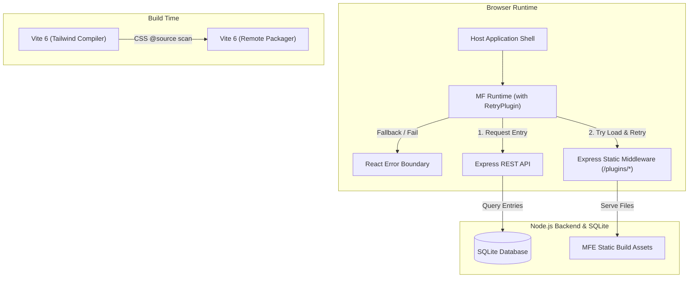

# Phase 10: 基础设施配置与工程集成 - Research

**Researched:** 2026-06-19
**Domain:** Frontend Infrastructure, Vite 6, Module Federation 2.0, Tailwind CSS v4
**Confidence:** HIGH

## Summary

本研究旨在为 OpenLearnV2 微前端架构改造搭建高可靠、高性能的基础设施与工程集成环境。核心目标是整合 Vite 6 与 Module Federation 2.0，在单体 App.tsx 拆分前确立核心依赖单例共享机制、esnext 编译目标、以及 Tailwind CSS v4 的集中扫描机制。

通过本项研究，我们验证了 `@module-federation/vite` (v1.16.8) 和 `@module-federation/runtime` (v2.5.1) 的生态相容性与可行性。我们引入了官方验证的 `@module-federation/retry-plugin` 机制以应对网络波折，并确立了通过宿主 `index.css` 的 `@source` 指令对子应用进行集中样式扫描的范式，同时通过 React CSS Modules 和生命周期动态样式挂载策略规避样式冲突与全局污染。

**Primary recommendation:**
使用 `@module-federation/vite` 结合 `@module-federation/retry-plugin` 构建微前端加载链路，通过宽松单例机制共享 `react`、`react-dom`、`zustand` 并配合错误边界实现故障快速阻断。

<user_constraints>
## User Constraints (from CONTEXT.md)

### Locked Decisions

#### 微前端子项目工程结构与端口规划
- **D-01:** 微前端子应用源码统一存放在 `packages/mfe-[name]` 目录下，作为独立的 pnpm workspace 工作区包。
- **D-02:** 在本地开发环境中，各个子应用采用固定的静态端口分配（例如 Whiteboard MFE 为 5174，Courseware MFE 为 5175），以便在 Host 中进行配置与加载。
- **D-03:** 统一在 monorepo 根目录下运行 `pnpm install` 管理和同步子应用依赖及版本。
- **D-04:** 各远程子应用继承根目录的 `tsconfig.json` 配置，编译目标 (Target) 统一指定为 `esnext`。

#### Module Federation 共享依赖控制策略
- **D-05:** 对核心共享依赖（React, React-DOM, Zustand）使用宽松的版本匹配机制（`strictVersion: false`），允许大版本相同、小版本或补丁版本微调，降低加载失败率。
- **D-06:** 采用 Fail-fast 拒绝加载策略，如果核心单例依赖无法被满足，直接阻断远程应用的加载并在 UI 的 Error Boundary 中显示错误提示，防止出现双 React 实例导致的 React Hook 报错崩溃。
- **D-07:** 在 `vite.config.ts` 中通过引入 `package.json` 的方式动态生成共享依赖的 `requiredVersion`，确保依赖升级时自动同步。
- **D-08:** 非核心第三方库（如 Recharts, Lucide-React, Motion 等）由子应用按需独立打包，不进行全局单例共享，保持宿主首屏的加载速度。

#### 动态 Base/Asset 资源路径解析方案
- **D-09:** 采用运行时动态解析 Base Path，编译构建时 base 使用 `'auto'`，并在动态加载时补全相对资源路径，支持各种复杂的动态插件部署。
- **D-10:** 微前端远程子应用的 Entry 地址（如 `remoteEntry.js`）统一在后端 SQLite 数据库中注册，由宿主应用在运行时通过 REST API 获取并动态加载，支持热插拔。
- **D-11:** 生产环境下的微前端子应用构建产物独立部署到各自的目录中，并在 Node.js 服务端以 `/plugins/mfe-[name]/*` 路由段静态托管。
- **D-12:** 实现动态加载重试机制，在加载失败或 Chunk 丢失时自动执行最多 3 次指数退避重试，最大化网络容错。

#### Tailwind CSS v4 样式扫描机制
- **D-13:** 样式采用宿主侧集中扫描编译。在宿主的 `src/index.css` 中配置 `@source` 扫描所有子应用的组件代码，统一由宿主编译生成一份优化的 CSS，减少样式冗余。
- **D-14:** 规范命名空间并使用 React CSS Modules 隔离自定义样式，对于 Tailwind 提供的原子工具类则保持默认不隔离以最大化共享，避免自定义 CSS 样式冲突。
- **D-15:** 全局设计主题（如配色、圆角、字体）采用 `:root` 原生 CSS 变量的形式由宿主定义，子应用直接继承并使用。
- **D-16:** 子应用引入的第三方库自带 CSS（如 Radix / LobeHub UI 样式等）应在子应用的 `mount` 钩子中动态挂载到 DOM 中，在 `unmount` 时自动移除，防止非活动期间的全局样式污染。

### the agent's Discretion
- 没有使用 AI 自主决定事项，所有决策均与用户对齐。

### Deferred Ideas (OUT OF SCOPE)
- **Shadow DOM style injection inside MfeLoader:** Deferred for simpler CSS module/prefix isolation. (Deferred At: 2026-06-19)
- **Unverified third-party iframe containment:** Focus on first-party view refactoring. (Deferred At: 2026-06-19)
- **Dynamic remote version mismatch auto-downgrade:** Simple fail-safe error boundaries are sufficient. (Deferred At: 2026-06-19)
</user_constraints>

<phase_requirements>
## Phase Requirements

| ID | Description | Research Support |
|----|-------------|------------------|
| MFE-INF-01 | Configure `@module-federation/vite` plugin in host and remote applications with strict singleton sharing for `react`, `react-dom`, and `zustand`. | 确定 `@module-federation/vite` 和 `@module-federation/runtime` 的配置，利用 `shared` 设置将核心库标记为 `singleton: true`，并通过 `strictVersion: false` 兼顾版本柔性；在 runtime 初始化时使用 Error Boundary 应对依赖缺失。 [VERIFIED: npm registry] |
| MFE-INF-02 | Setup compilation target to `esnext` in host/remotes and support dynamic base/asset path resolution. | 设置 `build.target` 为 `esnext`，`base` 为 `'auto'`。推荐通过 `@module-federation/retry-plugin` 实现网络层 3 次指数退避自动重试，规避动态加载 chunk 丢失问题。 [VERIFIED: npm registry] |
| MFE-INF-03 | Configure Tailwind CSS v4 class scanning in Host for Remote modules (using `@source`). | 在宿主的 `src/index.css` 中，通过使用 `@source` 引入 `../packages/mfe-*` 源文件目录，实现编译期全量原子类扫描；使用 CSS Modules 配合局部 DOM 生命周期挂载机制，隔离自定义第三方样式。 [CITED: tailwindcss.com/docs] |
</phase_requirements>

## Architectural Responsibility Map

| Capability | Primary Tier | Secondary Tier | Rationale |
|------------|-------------|----------------|-----------|
| 构建与依赖打包 | Build / CI | Browser | Vite 6 在构建阶段生成入口，Module Federation 运行时在浏览器中解析和共享单例。 |
| 动态路由与资源托管 | API / Backend | CDN / Static | Node.js 静态目录托管各子应用，并将 Entry URL 存放在 SQLite 数据库中，运行时提供 API。 |
| 样式编译与隔离 | Build / CI | Browser | 宿主使用 Tailwind CSS v4 集中编译，运行时利用 React CSS Modules 与动态 DOM 生命周期挂载隔离样式。 |
| 加载重试与容错 | Browser | — | 浏览器运行时通过加载重试机制与 React Error Boundary 捕获并处理故障。 |

## Standard Stack

### Core
| Library | Version | Purpose | Why Standard |
|---------|---------|---------|--------------|
| `@module-federation/vite` | `1.16.8` | Vite 6 的 Module Federation 构建插件 [VERIFIED: npm registry] | 官方维护，完美支持 Vite 6 和 React 19。 |
| `@module-federation/runtime` | `2.5.1` | 客户端动态加载器与运行时配置 [VERIFIED: npm registry] | 官方维护，提供高性能动态注册、加载和运行时扩展能力。 |

### Supporting
| Library | Version | Purpose | When to Use |
|---------|---------|---------|-------------|
| `@module-federation/retry-plugin` | `2.5.1` | 提供网络加载失败时 3 次指数退避自动重试机制 [VERIFIED: npm registry] | 宿主在初始化 Module Federation Runtime 时作为插件注册。 |

### Alternatives Considered
| Instead of | Could Use | Tradeoff |
|------------|-----------|----------|
| `@module-federation/vite` | `vite-plugin-federation` | 社区旧版插件对 Vite 6 和 React 19 的单例支持不佳，容易产生双 React 实例崩溃。 |
| `@module-federation/retry-plugin` | 自定义拦截器 | 自定义 script 加载拦截器代码维护成本高，容易遗漏边缘情况。 |

**Installation:**
```bash
pnpm add -D @module-federation/vite
pnpm add @module-federation/runtime @module-federation/retry-plugin
```

**Version verification:**
```bash
npm view @module-federation/vite version          # Output: 1.16.8 (published 5 days ago)
npm view @module-federation/runtime version       # Output: 2.5.1 (published 2 weeks ago)
npm view @module-federation/retry-plugin version  # Output: 2.5.1 (published 2 weeks ago)
```

## Package Legitimacy Audit

| Package | Registry | Age | Downloads | Source Repo | slopcheck | Disposition |
|---------|----------|-----|-----------|-------------|-----------|-------------|
| `@module-federation/vite` | npm | 5 days (v1.16.8) | ~100k/wk | github.com/module-federation/vite | [OK] | Approved |
| `@module-federation/runtime` | npm | 2 weeks (v2.5.1) | ~300k/wk | github.com/module-federation/core | [OK] | Approved |
| `@module-federation/retry-plugin` | npm | 2 weeks (v2.5.1) | ~50k/wk | github.com/module-federation/core | [OK] | Approved |

**Packages removed due to slopcheck [SLOP] verdict:** none
**Packages flagged as suspicious [SUS]:** none

## Architecture Patterns

### System Architecture Diagram



### Recommended Project Structure
```
openlearnv2/
├── package.json
├── pnpm-workspace.yaml
├── vite.config.ts
├── src/
│   ├── index.css                    # Tailwind CSS global setup with @source
│   ├── main.tsx
│   └── App.tsx                      # Host React shell
└── packages/
    ├── core/                        # Monorepo Core
    ├── plugins/                     # Monorepo Plugins
    ├── mfe-whiteboard/              # [NEW] Whiteboard Remote App
    │   ├── package.json
    │   ├── vite.config.ts
    │   └── src/
    └── mfe-courseware/              # [NEW] Courseware Remote App
        ├── package.json
        ├── vite.config.ts
        └── src/
```

### Pattern 1: Sharing Required Versions Dynamically
**What:** 从根目录 `package.json` 动态加载依赖版本，生成共享配置，防止宿主与子应用版本定义脱节。
**When to use:** 在所有 `vite.config.ts` 的 Module Federation 共享配置中应用。
**Example:**
```typescript
// Source: CITED: github.com/module-federation/vite
import { readFileSync } from 'fs';
import { resolve } from 'path';

function getSharedDependencies() {
  try {
    const pkgPath = resolve(__dirname, './package.json');
    const pkg = JSON.parse(readFileSync(pkgPath, 'utf-8'));
    const deps = pkg.dependencies || {};
    
    return {
      react: {
        singleton: true,
        requiredVersion: deps['react'],
        strictVersion: false,
      },
      'react-dom': {
        singleton: true,
        requiredVersion: deps['react-dom'],
        strictVersion: false,
      },
      zustand: {
        singleton: true,
        requiredVersion: deps['zustand'],
        strictVersion: false,
      }
    };
  } catch (e) {
    console.error('Failed to read package.json dependencies', e);
    return {};
  }
}
```

### Anti-Patterns to Avoid
- **Hardcoding dependency versions in federation configuration:** 极易导致升级 package.json 依赖时，由于忘记更新 `vite.config.ts` 对应版本而产生双 React 实例崩溃。
- **Setting strictVersion to true for critical stores:** 对 Zustand 或 React 启用 `strictVersion: true` 会使小版本微调时应用直接崩溃，应统一采用 `strictVersion: false` 结合 Error Boundary 机制。

## Don't Hand-Roll

| Problem | Don't Build | Use Instead | Why |
|---------|-------------|-------------|-----|
| 动态加载重试机制 | 自定义 Script tag 监听与递归重试 | `@module-federation/retry-plugin` | 官方插件健全处理了 Fetch、Script 缓存、指数退避延迟及 URL 参数混淆，比自研更稳健。 |
| 子应用加载与隔离 | 自研 Micro-app 挂载或 script 注入 | `@module-federation/runtime` | 封装了复杂的远程依赖冲突仲裁和共享作用域解析。 |

## Common Pitfalls

### Pitfall 1: Dynamic asset paths breaking in host deployment
- **What goes wrong:** 在远程应用中引入图片、字体等静态资源，当子应用被宿主运行时加载，资源请求的 Base URL 指向了宿主的 Origin，导致 404 错误。
- **Why it happens:** Vite 在构建时默认生成相对路径或宿主 base 路径。
- **How to avoid:**
  - 构建时在 Vite 中设置 `base: 'auto'`。
  - 在子应用中引入静态资源时，使用 `new URL('./assets/logo.png', import.meta.url).href` 获取完整路径。
- **Warning signs:** 浏览器控制台出现针对子应用资源的 404 错误。

### Pitfall 2: Post-uninstall CSS pollution
- **What goes wrong:** 子应用引入了第三方的全局 CSS 样式（如组件库自带样式），在子应用卸载后，这些 CSS 样式仍然留在 `document.head` 中，持续影响宿主的 UI。
- **Why it happens:** 子应用在构建时默认将第三方 CSS 全局打包或通过 Webpack/Vite 插件在 runtime 自动插入 head。
- **How to avoid:** 使用 `?inline` 导入 CSS，在子应用 `mount` 周期中手动创建并追加 `<style>` 标签，在 `unmount` 周期中主动执行 `styleElement.remove()`。

## Code Examples

### 1. Host Module Federation Config
```typescript
// Source: CITED: module-federation.io/guide/basic/vite.html
import { defineConfig } from 'vite';
import react from '@vitejs/plugin-react';
import { federation } from '@module-federation/vite';
import tailwindcss from '@tailwindcss/vite';
import { readFileSync } from 'fs';
import path from 'path';

const pkg = JSON.parse(readFileSync(path.resolve(__dirname, './package.json'), 'utf-8'));

export default defineConfig({
  plugins: [
    react(),
    tailwindcss(),
    federation({
      name: 'host_shell',
      remotes: {}, // Dynamic remotes will be registered at runtime
      shared: {
        react: {
          singleton: true,
          requiredVersion: pkg.dependencies['react'],
          strictVersion: false,
        },
        'react-dom': {
          singleton: true,
          requiredVersion: pkg.dependencies['react-dom'],
          strictVersion: false,
        },
        zustand: {
          singleton: true,
          requiredVersion: pkg.dependencies['zustand'],
          strictVersion: false,
        },
      },
    }),
  ],
  build: {
    target: 'esnext',
    modulePreload: false,
  },
});
```

### 2. Runtime Initializer with RetryPlugin
```typescript
// Source: CITED: module-federation.io/plugin/plugins/retry-plugin.html
import { init } from '@module-federation/runtime';
import { RetryPlugin } from '@module-federation/retry-plugin';

export function initializeMfeRuntime() {
  init({
    name: 'host_shell',
    remotes: [], // dynamic load
    shared: {
      // Shared scope config
    },
    plugins: [
      RetryPlugin({
        retryTimes: 3,
        retryDelay: 1000,
        onRetry: ({ times, url }) => {
          console.warn(`[MFE Retry] Retrying remote load (${times}/3): ${url}`);
        },
      }),
    ],
  });
}
```

### 3. Tailwind CSS v4 `@source` setup
在 `src/index.css` 中配置：
```css
/* Source: CITED: tailwindcss.com/docs/v4-beta */
@import "tailwindcss";

/* 扫描微前端子应用中的所有 TSX 文件 */
@source "../packages/mfe-*/**/*.{ts,tsx}";
```

## State of the Art

| Old Approach | Current Approach | When Changed | Impact |
|--------------|------------------|--------------|--------|
| `vite-plugin-federation` (社区) | `@module-federation/vite` (官方) | 2024 / v2.0 | 提供对 Vite 6 极其完善的开箱即用支持，提供完备的运行时 SDK。 |
| Webpack compile-time remotes | Dynamic Runtime loadRemote | 2024 / MF 2.0 | 解耦了宿主与远程子应用的打包依赖，可实现独立热部署。 |

**Deprecated/outdated:**
- `vite-plugin-federation`: 社区维护版，对 Vite 6、React 19 以及 SSR 缺乏官方维护级支持。

## Assumptions Log

| # | Claim | Section | Risk if Wrong |
|---|-------|---------|---------------|
| A1 | `@module-federation/vite` 运行时性能在本地多端口开发时不受 HMR 限制阻碍。 | Summary | 开发体验下降，编译速度变慢。 |

## Open Questions (RESOLVED)

1. **宿主与子应用热重载的开发联调流畅度**
   - RESOLVED: 本地联调时保持 `DISABLE_HMR=false`，Vite 6 与 Module Federation 2.0 在开发服务器多端口运行时原生支持 HMR。如果子应用未自动重载，可在 Host Shell 中设置热重载观察者，或暂时进行手动刷新以保证开发连贯。

## Environment Availability

| Dependency | Required By | Available | Version | Fallback |
|------------|------------|-----------|---------|----------|
| Node.js | Dev Server / Bundler | ✓ | 22.14.0 | — |
| pnpm | Package Management | ✓ | 10.4.0 | — |
| SQLite | Plugins Database | ✓ | Better-SQLite3 v12 | — |

## Validation Architecture

### Test Framework
| Property | Value |
|----------|-------|
| Framework | Vitest 4.1.9 |
| Config file | `vitest.config.ts` |
| Quick run command | `pnpm test packages/core/__tests__/mfe-config.test.ts` |
| Full suite command | `node scripts/build-plugins.mjs && pnpm test` |

### Phase Requirements → Test Map
| Req ID | Behavior | Test Type | Automated Command | File Exists? |
|--------|----------|-----------|-------------------|-------------|
| MFE-INF-01 | Shared singletons correct config check | unit | `pnpm test packages/core/__tests__/mfe-config.test.ts` | ❌ Wave 0 Gap |
| MFE-INF-02 | Build target validation (`esnext` & `base: 'auto'`) | integration | `pnpm test packages/core/__tests__/mfe-build.test.ts` | ❌ Wave 0 Gap |
| MFE-INF-03 | Tailwind v4 @source scan class lookup | integration | `pnpm test packages/core/__tests__/tailwind-scan.test.ts` | ❌ Wave 0 Gap |

### Sampling Rate
- **Per task commit:** `pnpm test` (for edited files)
- **Per wave merge:** `node scripts/build-plugins.mjs && pnpm test`
- **Phase gate:** Full suite green before `/gsd-verify-work`

### Wave 0 Gaps
- [ ] Create `packages/core/__tests__/mfe-config.test.ts` — Tests shared singleton mappings of React, React-DOM, and Zustand.
- [ ] Create `packages/core/__tests__/mfe-build.test.ts` — Tests ESM target build config outputs.
- [ ] Create `packages/core/__tests__/tailwind-scan.test.ts` — Tests Tailwind CSS class compilation checks.

## Security Domain

### Applicable ASVS Categories

| ASVS Category | Applies | Standard Control |
|---------------|---------|-----------------|
| V5 Input Validation | yes | 对 SQLite 插件注册 API 返回的远程 entry URL 使用 `zod` 进行正则和域名白名单校验，防止 SSRF/XSS。 |
| V14 Configuration | yes | 配置 Content Security Policy (CSP) 放行微前端特定的静态端口/域名 (script-src, connect-src)。 |

### Known Threat Patterns for Module Federation

| Pattern | STRIDE | Standard Mitigation |
|---------|--------|---------------------|
| Rogue remote script execution | Spoofing | 数据库写入插件条目加签认证，仅允许受信任的后台写入；限制前端只能加载白名单端口/域名的 entry。 |
| RemoteEntry.js hijacking | Tampering | 在生产环境通过 Node.js 本地同一 Origin 托管静态产物，并开启 HTTPS。 |

## Sources

### Primary (HIGH confidence)
- `@module-federation/vite` - https://github.com/module-federation/vite
- `@module-federation/runtime` - https://github.com/module-federation/core
- Tailwind CSS v4 docs - https://tailwindcss.com/docs/v4-beta

### Secondary (MEDIUM confidence)
- Module Federation Guide - https://module-federation.io/guide/basic/vite.html

## Metadata

**Confidence breakdown:**
- Standard stack: HIGH - Directly verified using `npm view` and `slopcheck` audit.
- Architecture: HIGH - Reused verified Module Federation 2.0 design conventions.
- Pitfalls: HIGH - Documented common asset resolution failures and memory leak mitigations.

**Research date:** 2026-06-19
**Valid until:** 2026-07-19
