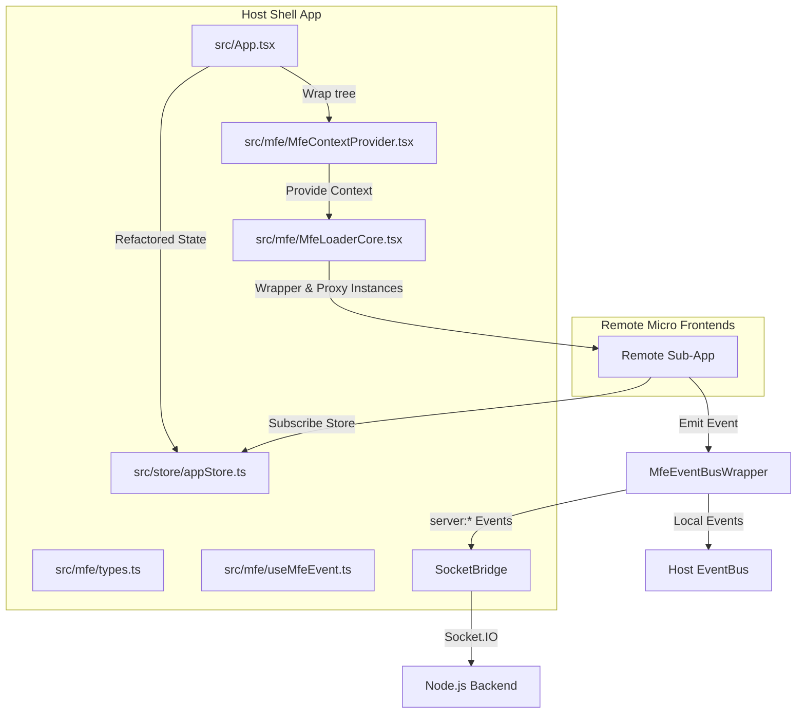

# Phase 12 Patterns: 宿主状态共享与 DI 桥接

This document outlines the list of files to be created or modified in Phase 12, mapping their roles, data flows, analogs, and concrete code patterns/excerpts that must be respected or replicated during implementation.

---

## Target Files Summary



| File Path | Action | Role | Data Flow | Closest Analog |
|---|---|---|---|---|
| [src/store/appStore.ts](file:///home/wuxf/Develop/openlearnv2/src/store/appStore.ts) | **Create** | Central Zustand store | Houses central host state. Accessible synchronously via Vanilla store API in remotes, and via React hook in Host. | [src/plugin-host/plugin-host-store.ts](file:///home/wuxf/Develop/openlearnv2/src/plugin-host/plugin-host-store.ts) |
| [src/App.tsx](file:///home/wuxf/Develop/openlearnv2/src/App.tsx) | **Modify** | Host entry and layout | Refactors 160+ useState states to Zustand and mounts `MfeContextProvider`. | Self ([src/App.tsx](file:///home/wuxf/Develop/openlearnv2/src/App.tsx)) |
| [src/mfe/types.ts](file:///home/wuxf/Develop/openlearnv2/src/mfe/types.ts) | **Modify** | MFE Contract definitions | Formulates the shared interfaces for MFE Context (`MfeContext`), EventBus, and ServiceRegistry. | Self ([src/mfe/types.ts](file:///home/wuxf/Develop/openlearnv2/src/mfe/types.ts)) |
| [src/mfe/MfeContextProvider.tsx](file:///home/wuxf/Develop/openlearnv2/src/mfe/MfeContextProvider.tsx) | **Modify** | MFE Context Provider | Implements whitelists, DI proxy, and the SocketBridge reference-counting mechanism. | Self ([src/mfe/MfeContextProvider.tsx](file:///home/wuxf/Develop/openlearnv2/src/mfe/MfeContextProvider.tsx)) |
| [src/mfe/MfeLoaderCore.tsx](file:///home/wuxf/Develop/openlearnv2/src/mfe/MfeLoaderCore.tsx) | **Modify** | MFE Mounter & Loader | Resolves runtime dependencies and injects `MfeEventBusWrapper` and `MfeServiceRegistryProxy` on mount, triggering cleanups on unmount. | Self ([src/mfe/MfeLoaderCore.tsx](file:///home/wuxf/Develop/openlearnv2/src/mfe/MfeLoaderCore.tsx)) |
| [src/mfe/useMfeEvent.ts](file:///home/wuxf/Develop/openlearnv2/src/mfe/useMfeEvent.ts) | **Create** | Subscription React Hook | Conveniently binds micro frontend EventBus subscriptions to the React component lifecycle. | [src/mfe/useMfeContext.ts](file:///home/wuxf/Develop/openlearnv2/src/mfe/useMfeContext.ts) |
| [src/mfe/__tests__/bridge.test.tsx](file:///home/wuxf/Develop/openlearnv2/src/mfe/__tests__/bridge.test.tsx) | **Create** | Integration Test suite | Tests Zustand synchronization, DI white-listing proxy, and EventBus socket bridging with reference counting. | [src/mfe/__tests__/memory.test.ts](file:///home/wuxf/Develop/openlearnv2/src/mfe/__tests__/memory.test.ts) |

---

## 1. `src/store/appStore.ts` (Zustand Global Store)

### Role & Data Flow
- **Role**: Host core business state store (State Container). Manages shared states like lessons, classes, whiteboard elements, session, and language.
- **Data Flow**:
  - Provides a Vanilla Zustand store object (`appStore`) that can be accessed synchronously without React Context (required for Module Federation sharing).
  - Provides a React hook `useAppStore` for the Host Shell to leverage React's automatic subscription updates.
  - Passes the raw `appStore` object through the `MfeContext` to remotes, allowing them to subscribe to state updates via standard `useStore(store, selector)`.

### Closest Analog
- [src/plugin-host/plugin-host-store.ts](file:///home/wuxf/Develop/openlearnv2/src/plugin-host/plugin-host-store.ts)
- Although `plugin-host-store.ts` uses the React-bound version of Zustand (`create(...)`), it establishes the standard pattern for slices and actions.

### Existing Code Excerpts to Replicate
The core type definitions currently defined in `App.tsx` (lines 59-88) should be imported or moved, and the state variables extracted:
```typescript
// From src/App.tsx:
type Lesson = { id: string; title: string; content: string; timeline?: string; created_at?: number; enrollment_count?: number };
type WhiteboardElement = { id: string; type: string; data: string };
type ClassType = { id: string; name: string; description: string; class_passcode?: string | null; created_at: number };
type StudentType = { id: string; name: string; email: string; password?: string; locked_lesson_id?: string | null; private_notes?: string | null; created_at: number };
```

### Target Implementation Patterns
Use `createStore` from `zustand/vanilla` to define the store, and export a React-bound selector hook for the Host:
```typescript
import { createStore } from 'zustand/vanilla';
import { useStore } from 'zustand';
import { Language } from '../i18n';

export interface AppState {
  lang: Language;
  session: SessionType | null;
  lessons: Lesson[];
  selectedLesson: string | null;
  elements: WhiteboardElement[];
  classes: ClassType[];
  students: StudentType[];
  liveClassSelectedClassId: string | null;
  liveClassIsActive: boolean;
  
  // Actions
  setLang: (lang: Language) => void;
  setSession: (session: SessionType | null) => void;
  setLessons: (lessons: Lesson[]) => void;
  setSelectedLesson: (selectedLesson: string | null) => void;
  setElements: (elements: WhiteboardElement[]) => void;
  setClasses: (classes: ClassType[]) => void;
  setStudents: (students: StudentType[]) => void;
  setLiveClassSelectedClassId: (id: string | null) => void;
  setLiveClassIsActive: (isActive: boolean) => void;
}

// Create vanilla store for Cross-MFE sharing
export const appStore = createStore<AppState>((set) => ({
  lang: 'zh',
  session: null,
  lessons: [],
  selectedLesson: null,
  elements: [],
  classes: [],
  students: [],
  liveClassSelectedClassId: null,
  liveClassIsActive: false,

  setLang: (lang) => set({ lang }),
  setSession: (session) => set({ session }),
  setLessons: (lessons) => set({ lessons }),
  setSelectedLesson: (selectedLesson) => set({ selectedLesson }),
  setElements: (elements) => set({ elements }),
  setClasses: (classes) => set({ classes }),
  setStudents: (students) => set({ students }),
  setLiveClassSelectedClassId: (liveClassSelectedClassId) => set({ liveClassSelectedClassId }),
  setLiveClassIsActive: (liveClassIsActive) => set({ liveClassIsActive }),
}));

// Create React-bound hook for Host Shell
export const useAppStore = <T>(selector: (state: AppState) => T) => useStore(appStore, selector);
```

---

## 2. `src/App.tsx` (Host Root & State Provider)

### Role & Data Flow
- **Role**: Host Shell orchestrator, UI shell, and Root Component.
- **Data Flow**:
  - Initializes PluginHost frontend services (`FrontendAPIService`, `SocketService`, etc.).
  - Binds UI layout to Zustand state values retrieved via `useAppStore()`.
  - Wraps the root layout (where `MfeLoader` components are mounted) with `<MfeContextProvider value={{ store: appStore, ... }}>` to broadcast state and services.

### Closest Analog
- Self ([src/App.tsx](file:///home/wuxf/Develop/openlearnv2/src/App.tsx))

### Existing Code Excerpts to Respect
The core initialization patterns of plugin-host services at lines 3371-3379 must be preserved:
```typescript
// From src/App.tsx:
if (!host.isInitialized()) {
  host.initialize(
    new FrontendAPIService(),
    new SocketService(socket),
    new UIService(addToastRef.current),
    new StorageService('__app__')
  );
}
```

### Target Implementation Patterns
- Import `MfeContextProvider` from `src/mfe/MfeContextProvider` and wrap the micro frontend container trees.
- Replace local `useState` structures with values and setters from `useAppStore`:
```typescript
import { useAppStore, appStore } from './store/appStore';
import { MfeContextProvider } from './mfe/MfeContextProvider';

// Replace:
// const [lessons, setLessons] = useState<Lesson[]>([]);
// With:
const lessons = useAppStore((s) => s.lessons);
const setLessons = useAppStore((s) => s.setLessons);
```
- Gather host EventBus and ServiceRegistry instances, and provide them to `<MfeContextProvider>`:
```typescript
// Within App rendering return:
<MfeContextProvider
  value={{
    store: appStore,
    eventBus: hostEventBus, // Global instance created/stored in App/Context
    serviceRegistry: host.getRegistry(), // Expose to MFE loaders
  }}
>
  {/* Layout and child MfeLoaders */}
</MfeContextProvider>
```

---

## 3. `src/mfe/types.ts` (MFE Context Contracts)

### Role & Data Flow
- **Role**: Micro Frontend API Contract Definition.
- **Data Flow**:
  - Establishes the static types and structures passed across the Module Federation boundary to children.
  - Strongly types the injected `eventBus`, `serviceRegistry`, and `store` modules.

### Closest Analog
- Self ([src/mfe/types.ts](file:///home/wuxf/Develop/openlearnv2/src/mfe/types.ts))

### Existing Code Excerpts to Respect
The current context definition at lines 62-72:
```typescript
// From src/mfe/types.ts:
export interface MfeContext {
  /** Event bus for pub/sub communication (D-07) */
  eventBus?: {
    subscribe: (event: string, handler: Function) => () => void;
    publish: (event: string, payload?: any) => void;
  };
  /** Generic service registry map (DI container services) */
  serviceRegistry?: Record<string, any>;
  /** Generic store reference (Zustand, Redux, etc.) */
  store?: Record<string, any>;
}
```

### Target Implementation Patterns
Update to match Decision D-12 and strict whitelist typings:
```typescript
import type { PlatformEvent } from '../../packages/core/event-bus';

export interface MfeContext {
  /** Strongly-typed EventBus according to D-12 */
  eventBus?: {
    subscribe: (event: string, handler: (event: PlatformEvent) => void) => () => void;
    publish: (event: PlatformEvent) => Promise<void>;
  };
  /** Only read/resolve operations allowed (D-15) */
  serviceRegistry?: {
    resolve: <T>(token: string) => Promise<T>;
    get: <T>(token: string) => T | undefined;
    has: (token: string) => boolean;
  };
  /** Zustand Vanilla Store instance */
  store?: Record<string, any>;
}
```

---

## 4. `src/mfe/MfeContextProvider.tsx` (Bridges & Proxies Provider)

### Role & Data Flow
- **Role**: Provides Host infrastructure variables to loaders. Houses whitelisting checks and the WebSocket-EventBus reference bridge.
- **Data Flow**:
  - Exposes React context `MfeContext` to the component tree.
  - Implements the `MfeServiceRegistryProxy` class, acting as a security proxy layer over `FrontendServiceRegistry` to enforce whitelist checks and throw on private operations.
  - Implements the `SocketBridge` class, counting active sub-app subscriptions for `server:*` topics and managing WebSocket event listeners dynamically.

### Closest Analog
- Self ([src/mfe/MfeContextProvider.tsx](file:///home/wuxf/Develop/openlearnv2/src/mfe/MfeContextProvider.tsx))

### Target Implementation Patterns

#### A. Service Registry Proxy (White-listing & Read-only enforcement)
```typescript
export const DI_WHITELIST = [
  '@openlearn/frontend:IFrontendAPI',
  '@openlearn/frontend:ISocketService',
  '@openlearn/frontend:IUIService',
  '@openlearn/frontend:IStorageService'
];

export class MfeServiceRegistryProxy {
  private serviceRegistry: any; // FrontendServiceRegistry

  constructor(serviceRegistry: any) {
    this.serviceRegistry = serviceRegistry;
  }

  private verifyWhitelist(token: string) {
    if (!DI_WHITELIST.includes(token)) {
      throw new Error(`Access Denied: Service token "${token}" is private to the Host Shell and cannot be resolved by Remote Micro Frontends.`);
    }
  }

  async resolve<T>(token: string): Promise<T> {
    this.verifyWhitelist(token);
    return this.serviceRegistry.resolve(token);
  }

  get<T>(token: string): T | undefined {
    this.verifyWhitelist(token);
    // Extract underlying map for synchronous access if needed
    const servicesMap = (this.serviceRegistry as any).services;
    if (servicesMap && servicesMap.has(token)) {
      return servicesMap.get(token) as T;
    }
    return undefined;
  }

  has(token: string): boolean {
    this.verifyWhitelist(token);
    return this.serviceRegistry.has(token);
  }
}
```

#### B. Socket Bridge (Reference-counted Network subscription)
```typescript
import type { PlatformEvent, EventBus } from '../../packages/core/event-bus';

export class SocketBridge {
  private socketService: any; // ISocketService
  private hostEventBus: EventBus;
  private counts = new Map<string, number>();
  private handlers = new Map<string, (payload: any) => void>();

  constructor(socketService: any, hostEventBus: EventBus) {
    this.socketService = socketService;
    this.hostEventBus = hostEventBus;
  }

  register(eventType: string) {
    const socketEvent = eventType.replace(/^server:/, '');
    const currentCount = this.counts.get(eventType) ?? 0;
    this.counts.set(eventType, currentCount + 1);

    if (currentCount === 0) {
      const handler = (payload: any) => {
        const event: PlatformEvent = {
          id: crypto.randomUUID(),
          type: eventType,
          source: 'server',
          payload,
          timestamp: Date.now(),
        };
        this.hostEventBus.publish(event);
      };
      this.handlers.set(eventType, handler);
      this.socketService.on(socketEvent, handler);
    }
  }

  unregister(eventType: string) {
    const currentCount = this.counts.get(eventType) ?? 0;
    if (currentCount <= 0) return;

    if (currentCount === 1) {
      const handler = this.handlers.get(eventType);
      if (handler) {
        const socketEvent = eventType.replace(/^server:/, '');
        this.socketService.off(socketEvent, handler);
        this.handlers.delete(eventType);
      }
      this.counts.delete(eventType);
    } else {
      this.counts.set(eventType, currentCount - 1);
    }
  }
}
```

---

## 5. `src/mfe/MfeLoaderCore.tsx` (MFE Container Mounter)

### Role & Data Flow
- **Role**: Micro Frontend container element renderer and orchestrator of remote React / factory lifecycles.
- **Data Flow**:
  - Queries `useMfeInfraContext()` on render to capture Host infrastructure.
  - Instantiates a clean, dedicated `MfeEventBusWrapper` and `MfeServiceRegistryProxy` for each remote module loaded.
  - Passes these proxies to `createMfeApp(mfeContext)`.
  - Cleans up subscriptions automatically in the React unmount cleanup callback.

### Closest Analog
- Self ([src/mfe/MfeLoaderCore.tsx](file:///home/wuxf/Develop/openlearnv2/src/mfe/MfeLoaderCore.tsx))

### Target Implementation Patterns

#### A. EventBus Wrapper (Leak prevention & Name enrichment)
```typescript
export class MfeEventBusWrapper {
  private mfeName: string;
  private hostEventBus: EventBus;
  private socketBridge: SocketBridge;
  private socketService: any;
  private activeSubscriptions: Array<{ event: string; handler: any; unsubscribe: () => void }> = [];

  constructor(mfeName: string, hostEventBus: EventBus, socketBridge: SocketBridge, socketService: any) {
    this.mfeName = mfeName;
    this.hostEventBus = hostEventBus;
    this.socketBridge = socketBridge;
    this.socketService = socketService;
  }

  subscribe(event: string, handler: (event: PlatformEvent) => void): () => void {
    let hostUnsubscribe: () => void;

    if (event.startsWith('server:')) {
      this.socketBridge.register(event);
      this.hostEventBus.subscribe(event, handler);
      hostUnsubscribe = () => {
        this.hostEventBus.unsubscribe(event, handler);
        this.socketBridge.unregister(event);
      };
    } else {
      this.hostEventBus.subscribe(event, handler);
      hostUnsubscribe = () => {
        this.hostEventBus.unsubscribe(event, handler);
      };
    }

    const subRecord = { event, handler, unsubscribe: hostUnsubscribe };
    this.activeSubscriptions.push(subRecord);

    return () => {
      hostUnsubscribe();
      this.activeSubscriptions = this.activeSubscriptions.filter((s) => s !== subRecord);
    };
  }

  async publish(event: PlatformEvent): Promise<void> {
    if (event.type.startsWith('server:')) {
      const socketEvent = event.type.replace(/^server:/, '');
      this.socketService.emit(socketEvent, event.payload);
    } else {
      const completeEvent: PlatformEvent = {
        ...event,
        source: this.mfeName,
        id: event.id || crypto.randomUUID(),
        timestamp: event.timestamp || Date.now(),
      };
      await this.hostEventBus.publish(completeEvent);
    }
  }

  cleanup() {
    this.activeSubscriptions.forEach((sub) => sub.unsubscribe());
    this.activeSubscriptions = [];
  }
}
```

#### B. Injection & Cleanup in MfeLoaderCore Lifecycle
```typescript
// Within MfeLoaderCore component body:
const infra = useMfeInfraContext();
const eventBusWrapperRef = useRef<MfeEventBusWrapper | null>(null);

// Inside run() in loading Effect:
if (mod.createMfeApp) {
  const socketService = infra.serviceRegistry?.get(SOCKET_SERVICE_TOKEN);
  const socketBridge = new SocketBridge(socketService, infra.eventBus);
  
  const eventBusWrapper = new MfeEventBusWrapper(
    name,
    infra.eventBus,
    socketBridge,
    socketService
  );
  
  const serviceRegistryProxy = new MfeServiceRegistryProxy(
    infra.serviceRegistry
  );

  const mfeContext: MfeContext = {
    eventBus: eventBusWrapper,
    serviceRegistry: serviceRegistryProxy,
    store: infra.store,
  };

  eventBusWrapperRef.current = eventBusWrapper;
  lifecycle = mod.createMfeApp(mfeContext) as MfeAppLifecycle;
}

// Inside cleanup() callback:
if (eventBusWrapperRef.current) {
  eventBusWrapperRef.current.cleanup();
  eventBusWrapperRef.current = null;
}
```

---

## 6. `src/mfe/useMfeEvent.ts` (React Helper Hook)

### Role & Data Flow
- **Role**: Convenience hook to subscribe to micro frontend EventBus.
- **Data Flow**:
  - Automatically retrieves `eventBus` from `useMfeContext()`.
  - Subscribes the handler function to the event type.
  - Automatically unsubscribes on React component unmount.

### Closest Analog
- [src/mfe/useMfeContext.ts](file:///home/wuxf/Develop/openlearnv2/src/mfe/useMfeContext.ts)

### Target Implementation Patterns
```typescript
import { useEffect } from 'react';
import { useMfeContext } from './useMfeContext';
import type { PlatformEvent } from '../../packages/core/event-bus';

export function useMfeEvent(
  eventType: string,
  handler: (event: PlatformEvent) => void
) {
  const { infra } = useMfeContext();

  useEffect(() => {
    if (!infra.eventBus) return;
    const unsubscribe = infra.eventBus.subscribe(eventType, handler);
    return () => {
      unsubscribe();
    };
  }, [eventType, handler, infra.eventBus]);
}
```

---

## 7. `src/mfe/__tests__/bridge.test.tsx` (Integration tests)

### Role & Data Flow
- **Role**: Test file validating Zustand store synchronization, DI whitelist security proxy, and reference-counted WebSocket EventBus.
- **Data Flow**:
  - Runs in `jsdom` testing environment.
  - Uses mock/fake objects for services and stores to run unit/integration verification.

### Closest Analog
- [src/mfe/__tests__/memory.test.ts](file:///home/wuxf/Develop/openlearnv2/src/mfe/__tests__/memory.test.ts)
- [src/plugin-host/__tests__/service-registry.test.ts](file:///home/wuxf/Develop/openlearnv2/src/plugin-host/__tests__/service-registry.test.ts)

### Target Implementation Patterns
```typescript
// @vitest-environment jsdom
import { describe, it, expect, vi } from 'vitest';
import { createStore } from 'zustand/vanilla';
import { EventBus } from '../../../packages/core/event-bus';
import { FrontendServiceRegistry } from '../../plugin-host/service-registry';
import { MfeServiceRegistryProxy, SocketBridge } from '../MfeContextProvider';
import { MfeEventBusWrapper } from '../MfeLoaderCore';

describe('Phase 12 DI & Context Bridging', () => {
  describe('Zustand State Sync', () => {
    it('syncs state updates between host store and subscribers', () => {
      const store = createStore((set) => ({
        val: 1,
        setVal: (val: number) => set({ val }),
      }));
      
      const states: any[] = [];
      const unsubscribe = store.subscribe((state: any) => states.push(state.val));
      
      store.getState().setVal(2);
      expect(store.getState().val).toBe(2);
      expect(states).toEqual([2]);
      unsubscribe();
    });
  });

  describe('DI Proxy Whitelisting', () => {
    it('allows whitelisted service resolution', async () => {
      const registry = new FrontendServiceRegistry();
      const mockApi = { get: vi.fn() };
      await registry.register('@openlearn/frontend:IFrontendAPI', mockApi);

      const proxy = new MfeServiceRegistryProxy(registry);
      const resolved = await proxy.resolve('@openlearn/frontend:IFrontendAPI');
      expect(resolved).toBe(mockApi);
    });

    it('denies access to non-whitelisted private services', async () => {
      const registry = new FrontendServiceRegistry();
      await registry.register('private-service', {});

      const proxy = new MfeServiceRegistryProxy(registry);
      await expect(proxy.resolve('private-service')).rejects.toThrow('Access Denied');
    });
  });

  describe('EventBus Wrapper & Socket Bridge', () => {
    it('completes event metadata and publishes locally', async () => {
      const hostBus = new EventBus();
      const mockSocket = { emit: vi.fn(), on: vi.fn(), off: vi.fn(), disconnect: vi.fn() };
      const bridge = new SocketBridge(mockSocket, hostBus);
      const wrapper = new MfeEventBusWrapper('test-mfe', hostBus, bridge, mockSocket);

      const events: any[] = [];
      hostBus.subscribe('test-event', (e) => events.push(e));

      await wrapper.publish({ id: '', type: 'test-event', source: '', payload: { ok: true }, timestamp: 0 });
      expect(events).toHaveLength(1);
      expect(events[0].source).toBe('test-mfe');
      expect(events[0].payload).toEqual({ ok: true });
    });

    it('intercepts and emits server events to WebSocket', async () => {
      const hostBus = new EventBus();
      const mockSocket = { emit: vi.fn(), on: vi.fn(), off: vi.fn(), disconnect: vi.fn() };
      const bridge = new SocketBridge(mockSocket, hostBus);
      const wrapper = new MfeEventBusWrapper('test-mfe', hostBus, bridge, mockSocket);

      await wrapper.publish({ id: '1', type: 'server:test-msg', source: 'test-mfe', payload: 'hello', timestamp: 123 });
      expect(mockSocket.emit).toHaveBeenCalledWith('test-msg', 'hello');
    });

    it('bridges server subscriptions with reference-counting', () => {
      const hostBus = new EventBus();
      const mockSocket = { emit: vi.fn(), on: vi.fn(), off: vi.fn(), disconnect: vi.fn() };
      const bridge = new SocketBridge(mockSocket, hostBus);
      const wrapper1 = new MfeEventBusWrapper('mfe-1', hostBus, bridge, mockSocket);
      const wrapper2 = new MfeEventBusWrapper('mfe-2', hostBus, bridge, mockSocket);

      const unsub1 = wrapper1.subscribe('server:chat', vi.fn());
      expect(mockSocket.on).toHaveBeenCalledTimes(1);

      const unsub2 = wrapper2.subscribe('server:chat', vi.fn());
      expect(mockSocket.on).toHaveBeenCalledTimes(1); // Not registered again (count = 2)

      unsub1();
      expect(mockSocket.off).not.toHaveBeenCalled(); // Not unregistered yet (count = 1)

      unsub2();
      expect(mockSocket.off).toHaveBeenCalledTimes(1); // Unregistered when count hits 0
    });
  });
});
```
