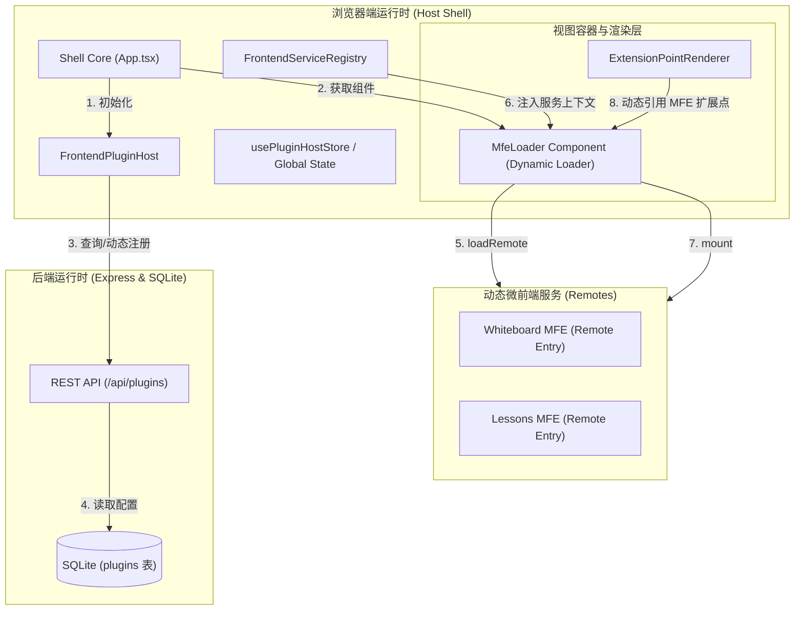
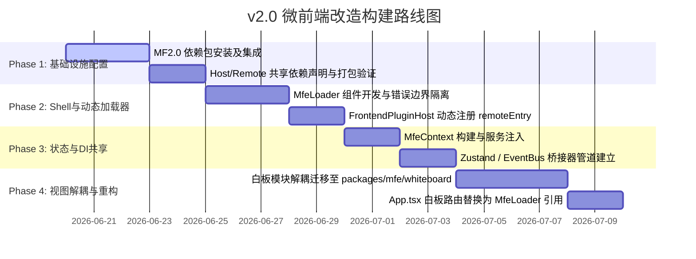

# 架构设计：基于 Vite Module Federation 的微前端改造

**领域：** 教育操作系统微前端（MFE）架构设计与改造
**研究日期：** 2026-06-19
**置信度：** HIGH

---

## 核心选型与设计原则

对于 OpenLearnV2 前端大单体（`App.tsx`）的拆分，**我们选择使用官方的 `@module-federation/vite` 结合 `@module-federation/runtime`（Module Federation 2.0）**，而非社区的 `@originjs/vite-plugin-federation`。

### 为什么选择 Module Federation 2.0？

1. **动态远程加载 (Dynamic Remotes)**：官方 `@module-federation/runtime` 提供了高级的 `registerRemotes` 和 `loadRemote` API，允许宿主应用（Shell）在运行时动态发现、注册并加载微前端模块，而非在编译期硬编码 `vite.config.ts` 中的 `remotes`。这与 OpenLearnV2 基于数据库配置动态启停插件的机制高度契合。
2. **多包共享单例控制 (Singleton Sharing)**：React 19 等现代框架依赖全局单例上下文。MF 2.0 拥有最先进的冲突决策和版本协商引擎，能够严格确保 `react`、`react-dom`、`zustand` 等核心依赖在基座与微前端应用之间只存在单例，彻底杜绝了 Multiple React Instances 导致的 hooks 崩溃问题。
3. **Rolldown/Vite 6 兼容性**：作为 Module Federation 核心团队维护 of 官方插件，它对 Vite 6 的 Environment API 提供了最原生的支持，具备面向未来的演进路径。

---

## 系统架构图 (System Architecture)



---

## 动态加载器与生命周期挂载规范 (Dynamic Shell & MfeLoader)

微前端的加载必须做到对视图层的解耦。我们引入一个通用的 React 组件 `MfeLoader`，用于统一处理微前端的异步加载、生命周期挂载、错误边界隔离和 Loading 态展示。

### 1. 微前端挂载生命周期契约 (Lifecycle Contract)

每个微应用入口模块（Exposed Entry）必须实现并导出以下标准化生命周期接口：

```typescript
export interface MfeContext {
  /** 经过 DI 容器解析出的宿主核心服务 */
  services: {
    frontendApi: any;
    socketService: any;
    uiService: any;
    storageService: any;
  };
  /** 宿主 Zustand Store 状态读取与订阅通道 */
  state: {
    getState: () => any;
    subscribe: (listener: (state: any, prevState: any) => void) => () => void;
  };
  /** 微应用元数据 */
  manifest: {
    id: string;
    version: string;
  };
}

export interface MicroFrontendModule {
  /** 模块加载时的初始化逻辑（可选） */
  bootstrap?: (ctx: MfeContext) => Promise<void>;
  /** 挂载到宿主指定的 DOM 节点上 */
  mount: (container: HTMLElement, ctx: MfeContext) => Promise<void>;
  /** 卸载并清理该 DOM 节点上的资源（防止内存泄漏） */
  unmount: (container: HTMLElement) => Promise<void>;
}
```

### 2. 动态加载组件 `MfeLoader` 实现设计

`MfeLoader` 本身应作为一个高阶容器：

```tsx
import React, { useEffect, useRef, useState } from 'react';
import { loadRemote } from '@module-federation/runtime';
import { usePluginHost } from '../plugin-host/plugin-host-context';
import { usePluginHostStore } from '../plugin-host/plugin-host-store';

interface MfeLoaderProps {
  remoteName: string;      // 例如: 'whiteboard'
  exposedModule: string;   // 例如: './WhiteboardApp'
  fallback?: React.ReactNode;
}

export function MfeLoader({ remoteName, exposedModule, fallback }: MfeLoaderProps) {
  const containerRef = useRef<HTMLDivElement>(null);
  const [loading, setLoading] = useState(true);
  const [error, setError] = useState<Error | null>(null);
  const host = usePluginHost();
  const mfeInstanceRef = useRef<any>(null);

  useEffect(() => {
    let active = true;
    const container = containerRef.current;
    if (!container) return;

    async function initAndMount() {
      try {
        setLoading(true);
        // 1. 动态加载 Module Federation 远程暴露出的组件模块
        const module = (await loadRemote(`${remoteName}/${exposedModule}`)) as any;
        
        if (!active) return;
        
        // 2. 校验生命周期契约
        if (!module || typeof module.mount !== 'function') {
          throw new Error(`MFE ${remoteName} does not expose a mount function.`);
        }
        mfeInstanceRef.current = module;

        // 3. 构建依赖注入上下文 (Context)
        const services = host.getServices(); // 获取宿主注入的所有 IService
        const stateBridge = {
          getState: () => usePluginHostStore.getState(),
          subscribe: (listener: any) => usePluginHostStore.subscribe(listener),
        };
        const ctx: MfeContext = {
          services,
          state: stateBridge,
          manifest: { id: remoteName, version: '1.0.0' }
        };

        // 4. 执行生命周期挂载
        if (module.bootstrap) {
          await module.bootstrap(ctx);
        }
        await module.mount(container, ctx);
        
        if (active) setLoading(false);
      } catch (err: any) {
        if (active) {
          setError(err);
          setLoading(false);
        }
      }
    }

    initAndMount();

    // 5. 卸载清理 (Unmount Cleanup)
    return () => {
      active = false;
      if (container && mfeInstanceRef.current?.unmount) {
        mfeInstanceRef.current.unmount(container).catch((err: any) => {
          console.error(`Failed to unmount MFE ${remoteName}:`, err);
        });
      }
    };
  }, [remoteName, exposedModule, host]);

  if (error) {
    return (
      <div className="p-4 border border-red-200 bg-red-50 text-red-700 rounded-xl">
        <h4 className="font-bold">Micro-frontend loading failed</h4>
        <p className="text-xs">{error.message}</p>
      </div>
    );
  }

  return (
    <div className="w-full h-full min-h-32 relative">
      {loading && (fallback ?? <div className="animate-pulse bg-gray-100 rounded-xl w-full h-64" />)}
      <div ref={containerRef} className="w-full h-full" style={{ display: loading ? 'none' : 'block' }} />
    </div>
  );
}
```

---

## 宿主核心服务 (ServiceRegistry / PluginHost) 集成

微前端模块不是孤立运行的，它必须无缝地同宿主的依赖注入（DI）系统和插件机制打通。

### 1. 依赖注入桥接 (Dependency Injection Bridging)

现有 `FrontendServiceRegistry` 管理着宿主的核心服务实例。
在微前端的 `mount` 函数被调用时，宿主将这些服务实例显式打包进 `MfeContext.services` 传入。

> [!IMPORTANT]
> **绝对禁止**微应用直接通过全局变量（如 `window.services`）越权访问宿主内核。一切外部依赖必须通过 `MfeContext` 协议自上而下进行契约化注入。这保证了代码的隔离性，也利于单体测试中进行 Mock 注入。

### 2. 插件宿主桥接 (PluginHost Integration)

当我们在后台安装或启用包含微前端的插件时，宿主的 `FrontendPluginHost` 生命周期行为如下：

1. **发现远程元数据**：当调用 `installPlugin` / `activatePlugin` 时，宿主从服务端获取微应用的 `remoteEntry.js` 地址或 manifest 信息。
2. **运行时注册**：`FrontendPluginHost` 通过调用 `@module-federation/runtime` 的 `registerRemotes`，将远程微应用的地址录入 Module Federation 路由表中。
3. **UI 扩展点注册**：如果微前端插件在其清单中声明了 UI 扩展点，它在 `activate` 过程中，会向 `ExtensionPointRegistry` 注册对应的加载逻辑：
   ```typescript
   // MFE 激活时向宿主注册 UI 扩展
   host.registerExtensionPoint('teacher.tab', {
     id: 'mfe-whiteboard-tab',
     label: 'Interactive Whiteboard',
     component: () => Promise.resolve({
       default: () => <MfeLoader remoteName="whiteboard" exposedModule="./WhiteboardTab" />
     }),
     pluginId: 'whiteboard-plugin'
   });
   ```
   如此一来，现有的 `ExtensionPointRenderer` 能够完全无需改动，直接无缝渲染微前端视图！

---

## 宿主状态共享与数据流 (State Sharing & Communication)

宿主与微应用之间存在频繁的交互，这通过两层通信机制保障：

### 1. Zustand 状态同步管道

为避免各微应用独立打包 `zustand` 产生各自的状态副本，我们在构建配置中强制声明 `zustand` 为单例共享。
宿主将核心 store 的 `getState` 和 `subscribe` 暴露给微应用。微应用内部可通过包装好的辅助 Hooks，直接消费宿主状态的切片：

```typescript
// 在微前端应用内部封装的共享 Hook 示例
import { useState, useEffect } from 'react';

export function useHostState<T>(selector: (state: any) => T, mfeCtx: MfeContext): T {
  const [slice, setSlice] = useState(() => selector(mfeCtx.state.getState()));

  useEffect(() => {
    return mfeCtx.state.subscribe((state) => {
      setSlice(selector(state));
    });
  }, [mfeCtx, selector]);

  return slice;
}
```

### 2. EventBus 事件桥接 (Worker RPC & Socket)

微前端如需向系统其他模块发送通知或执行指令，统一调用通过 `MfeContext.services.socketService` 注入的通信总线。
例如，微白板在绘制图形时：
```typescript
// 微应用代码中发送同步事件
ctx.services.socketService.emit('whiteboard.draw', { x: 10, y: 20 });
```
事件将通过宿主的 `SocketService` 流向后端，并被其他用户的客户端接收，从而保持数据一致性。

---

## 项目重构路径与目录结构

建议在现有的 Monorepo 目录中引入新的微前端目录：

```
openlearnv2/
├── package.json
├── vite.config.ts                      # 宿主 (Host) 的 Vite 配置，集成 MF Host
├── src/                                # 宿主源代码 (Shell App)
│   ├── App.tsx                         # 核心布局与路由（解耦后）
│   ├── main.tsx                        # 初始化 MF Runtime
│   └── components/
│       └── MfeLoader.tsx               # ★ NEW: 通用微应用加载器
├── packages/
│   ├── core/                           # 核心后端逻辑
│   ├── plugins/                        # 内置后端/内联插件
│   └── mfe/                            # ★ NEW: 微前端子应用存放目录
│       ├── whiteboard/                 # 白板微应用 (Remote)
│       │   ├── package.json
│       │   ├── vite.config.ts          # 集成 MF Remote 插件，配置 exposed
│       │   └── src/
│       │       ├── index.ts            # ★ 导出 mount/unmount 生命周期入口
│       │       └── WhiteboardApp.tsx   # 白板独立 UI
│       └── lessons-admin/              # 课程管理微应用 (Remote)
```

### 构建配置设计 (vite.config.ts)

#### 1. 宿主 (Host) 配置示例
```typescript
import { defineConfig } from 'vite';
import react from '@vitejs/plugin-react';
import { federation } from '@module-federation/vite';

export default defineConfig({
  plugins: [
    react(),
    federation({
      name: 'host-shell',
      shared: {
        react: { singleton: true, requiredVersion: '^19.0.0' },
        'react-dom': { singleton: true, requiredVersion: '^19.0.0' },
        zustand: { singleton: true },
        'lucide-react': { singleton: true }
      }
    })
  ]
});
```

#### 2. 微应用 (Remote - Whiteboard) 配置示例
```typescript
import { defineConfig } from 'vite';
import react from '@vitejs/plugin-react';
import { federation } from '@module-federation/vite';

export default defineConfig({
  plugins: [
    react(),
    federation({
      name: 'whiteboard',
      filename: 'remoteEntry.js',
      exposes: {
        './WhiteboardApp': './src/index.ts', // 暴露生命周期入口
      },
      shared: {
        react: { singleton: true, requiredVersion: '^19.0.0' },
        'react-dom': { singleton: true, requiredVersion: '^19.0.0' },
        zustand: { singleton: true },
        'lucide-react': { singleton: true }
      }
    })
  ],
  server: {
    port: 5001 // 每个微应用独立端口运行
  }
});
```

---

## 落地构建顺序建议 (Build Order Roadmap)



---

## 质量把控与反模式预防 (Quality Gates)

- **强单例守卫**：构建阶段必须执行 `npm run build`，严防未对齐的第三方包导致 Remote 和 Host 打包出双份 React 运行环境。
- **内存泄漏审计**：子应用在 `unmount` 中必须彻底执行 React 的 `root.unmount()` 并解绑一切全局 `window` 监听器和 `Socket` 事件，若审计发现内存未回落则视为质量不合格。
- **错误降级隔离**：单个微应用加载或运行时崩溃，必须被 `ExtensionErrorBoundary` 捕获，显示局部降级提示，严禁导致整个 Shell 宿主白屏。
