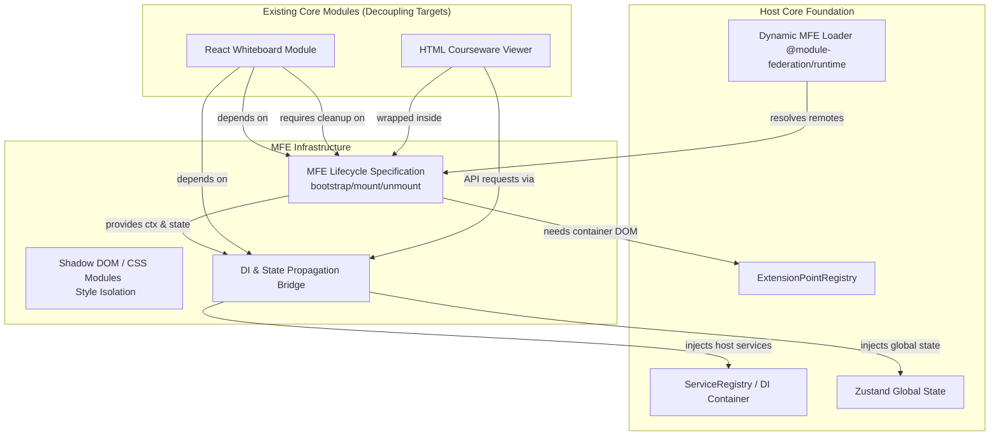

# Feature Research — Micro-frontends & Vite Module Federation

**Domain:** Vite Module Federation 微前端架构（教育 OS / LMS 平台 OpenLearnV2）  
**Researched:** 2026-06-19  
**Confidence:** HIGH  

---

## 1. Domain Ecosystem Overview

在插拔式 LMS（学习管理系统）或教育操作系统中，微前端（Micro-frontends, MFE）的核心价值在于**将庞大单体前端解耦，使第三方或内置教学工具（如交互白板、拼图游戏、考勤工具）能够以独立的、版本化的微应用形式动态加载到主界面（Shell App）中，且共享统一的协作上下文。**

本项目的生态架构由以下核心部分组成：
1. **宿主应用 (Shell App)**：负责基础框架、全局布局（Header/Sidebar）、用户认证、路由配置及公共状态。它提供一个全局 of `ServiceRegistry` (依赖注入容器) 和全局事件总线。
2. **动态加载器 (MFE Loader)**：集成 `@module-federation/enhanced/runtime`，在运行时通过读取插件元数据中的 `mf-manifest.json`，动态注册并导入远程 Entry 模块。
3. **扩展插槽 (UI Slots)**：通过插槽模式将动态加载的 MFE 渲染到特定位置（例如 `classroom.tool`、`student.view`、`teacher.tab`）。
4. **子应用 (Remote MFE)**：解耦后的独立微前端应用，实现平台规范的生命周期接口，并通过宿主传递的上下文获取 API 请求、实时通信及状态共享能力。

---

## 2. Feature Landscape

### Table Stakes（用户预期必需）

这些是保障微前端系统能在 LMS 场景正常运行的基础能力，缺失任何一项都会导致协作状态断开或系统崩溃。

| Feature | Detailed Specification & Rationale | Complexity | Integration Details |
| :--- | :--- | :--- | :--- |
| **运行时动态 MFE 加载** | **必须使用 `@module-federation/enhanced/runtime` 的 `init()` 与 `loadRemote()` 进行动态注册。** 绝不能在 `vite.config.ts` 中硬编码 remotes 静态地址。因为插件系统中的微前端远程地址（来自开发者本地或动态安装的 ZIP 包解压后的静态服务器）是在运行时动态生成的。 | MEDIUM | 启动时及插件状态改变（启用/禁用）时，动态更新 Federation 注册表。 |
| **MFE 生命周期挂载规范** | **子应用必须导出标准生命周期对象**：`bootstrap(ctx)`、`mount(container, props)`、`unmount(container)`。在 `unmount` 中必须显式调用 React 19 的 `root.unmount()`。这是为了确保在多课件/多房间切换时，彻底销毁 Canvas、WebGL 上下文、定时器以及事件绑定，杜绝内存泄漏。 | MEDIUM | 包装 `ExtensionPointRenderer` 适配器，在 DOM 挂载点执行子生命周期。 |
| **宿主状态与上下文共享** | **宿主必须将 Zustand 状态 store (教室 session、当前班级、用户信息) 和依赖注入实例 (DI Registry) 传给子应用。** 绝不能让子应用独立创建 Socket.io 链接或独立获取 API 上下文。这保证了协作课堂中的状态强一致，并大幅减少连接损耗。 | HIGH | 通过 `bootstrap(ctx)` 将宿主的 `IFrontendAPI`、`ISocketService` 等 Token 代理服务注入子应用。 |
| **插槽式动态 UI 路由解耦** | **核心路由与组件必须脱离原 App.tsx 的单体控制，统一注册到宿主的 `ExtensionPointRegistry` 中。** 宿主基于 Slot（插槽）渲染对应组件，使前端完全插件化。 | MEDIUM | 扩展现有的 `ExtensionPointRegistry`，使之支持由加载器动态拉取的组件。 |
| **白板与课件微前端化解耦** | **必须将 App.tsx 中庞大的 React Whiteboard 交互逻辑和 HTML 课件播放器彻底剥离为独立的 MFE 模块。** 这样既能实现单体瘦身（App.tsx 减负），又能支持白板、课件的独立开发迭代。 | HIGH | 涉及将 Canvas SVG 渲染逻辑、Socket.io 白板笔迹广播通道与 App.tsx 剥离。 |

---

### Differentiators（竞争优势）

这些特性提升了开发者的体验，保障了微应用之间的样式与依赖隔离，使得 OpenLearnV2 的插件化体验极其 premium。

| Feature | Value Proposition & Rationale | Complexity | Implementation Strategy |
| :--- | :--- | :--- | :--- |
| **样式隔离与沙箱保护 (CSS Isolation)** | **使用 CSS Modules 或 Shadow DOM 对微应用进行样式沙箱包装。** 保证微应用内样式的修改绝对不会穿透并污染宿主样式（反之亦然），避免 Tailwind 冲突导致的排版崩塌。 | MEDIUM | 在 `mount` 时可选择将子应用渲染到宿主 DOM 下的 Shadow Root 中，或使用特定的 CSS 命名空间。 |
| **共享依赖版本与 Fallback 策略** | **配置共享 React 19、React DOM、Zustand、lucide-react。** 强约束 singleton: true 以确保宿主与子应用使用同一个 React 实例（防止 React Context 失效）；若其他辅助库版本冲突，则自动回退下载子应用自带版本，保持灵活度。 | MEDIUM | 在 Vite Federation 插件中精确配置 `shared` 字段。 |
| **微前端嵌套路由动态桥接** | **宿主路由表（React Router）向微前端开放 API，支持动态注入深层路由。** 例如白板应用能注册路由 `/lessons/:id/whiteboard`，使用户在直接访问 URL 时可直接定位，提供原生应用级路由体验。 | HIGH | 宿主路由包含通配符占位符，匹配后由子应用内接管路由解析。 |
| **开发者本地 HMR 调试桥接** | **在开发模式下，宿主能无刷新热重载正在编写的子应用。** 通过文件监控 manifest 变动，自动注销、重新下载并重新 mount 子应用。 | HIGH | 基于 Vite 的 HMR Socket 通道，向宿主广播变动，触发 `unmount` 与重新 `mount` 流程。 |

---

### Anti-Features（主动不构建的能力）

为了控制复杂度，确保系统安全、高内聚和极致的网络性能，以下能力被明确排除：

| Feature | Why Requested | Why Problematic | Alternative |
| :--- | :--- | :--- | :--- |
| **服务端渲染 (MFE SSR)** | 减少首屏加载时间，提高加载速度。 | LMS 是强交互协作系统（实时白板、命令终端、AI 助手），核心逻辑都在浏览器内。MFE SSR 会极大增加 Node 服务端部署复杂性，带来沙箱安全风险。 | **全客户端渲染 (SPA)**，通过合理的 HTTP 缓存与 CDN 分包提升首屏加载。 |
| **子前端直接访问数据库或 VFS** | 子前端为了追求速度，希望直接读取 SQLite 或 Node VFS。 | 破坏前后端隔离。安全灾难——任何恶意的微前端都可以随意修改或窃取其他班级、学生的数据。 | **必须通过 `IFrontendAPI` (或 DI Token 代理服务)** 向后端 PluginHost 发起受控的 command/query，并受限于 CapabilityGuard。 |
| **多框架混合渲染 (Vue/Angular)** | 开发者想用自己熟悉的框架开发微应用。 | 在弱网教学环境下，多框架会导致基础 bundle 大量膨胀。状态管理、依赖注入和事件总线的多框架桥接会让维护成本失控。 | **强制统一规范：** 所有微前端必须使用 React 19 或原生 JavaScript (Web Components) 编写。 |
| **微应用全局状态直接互改** | MFE A 直接修改 MFE B 的 Zustand store 状态。 | 极高的耦合度，会导致其中一个应用 deactivate 时发生内存泄漏或状态脏化，极难排查。 | **所有跨应用通信必须通过 `IEventBusService` 异步进行**，发送标准 namespace 事件（如 `whiteboard:update`）。 |

---

## 3. Feature Dependencies

以下展示了微前端特征、核心宿主以及现有业务（白板与课件）之间的深层依赖关系。

### Dependency & Complexity Analysis

1. **生命周期对宿主插槽的依赖**：
   - 动态加载的微应用必须在指定的 DOM 挂载点被 `mount`。因此，`ExtensionPointRenderer` 扮演了“生命周期执行器”的角色。当宿主决定销毁某个 Slot 视图时，它必须触发子应用的 `unmount`。
2. **白板 (Whiteboard) 的生命周期与清理复杂度（HIGH）**：
   - 白板不仅仅是简单的 UI 组件，它拥有大量的**持久副作用**：Canvas 的画布对象、画布大小 Resize 监听器、WebSocket (Socket.io) 笔迹广播监听通道。
   - 依赖关系：白板 MFE 必须从 `bootstrap(ctx)` 获取宿主的 `ISocketService` 实例，以在教室内同步绘图动作。
   - 复杂度细节：在 `unmount(container)` 执行时，必须显式调用自定义的清理函数，退订当前 lesson 的 whiteboard 房间通道、注销 canvas DOM 事件、重置全局画布缓存，否则用户再次打开白板时会出现多重事件触发、画布大小错乱、甚至不同班级笔迹串线的问题。
3. **课件 (Courseware) 的沙箱与 API 桥接（MEDIUM）**：
   - 现有的 HTML 课件文件存储于宿主的 VFS（虚拟文件系统）中，并在前端通过 iframe 承载以实现基础的 DOM 隔离。
   - 依赖关系：课件 MFE 必须在初始化时获得宿主注入的 `attemptId` 与接口 Token，以便课件页面通过 PostMessage 向宿主（进而向后端 `/api/courseware/attempts/...`）提交学生的答题成绩与日志。
   - 复杂度细节：微前端化后，课件 MFE 本身将作为 Iframe 的容器，对宿主屏蔽底层 Iframe 的 postMessage 事件细节，向上仅提供 `onSubmit` 等 React 事件回调，实现数据与展现的优雅解耦。

---

## 4. MVP Definition (v2.0 Milestone Phases)

根据 `v2.0` 微前端架构改造需求，我们将微前端特性的构建分为三个渐进式阶段：

### Phase 1: 宿主容器拆分与运行时 Federation（MFE-01, MFE-02）
*构建基础的加载与依赖共享环境。*
- [ ] **集成 `@module-federation/vite` 与运行时加载器**：配置宿主的 shared 依赖（`react@19`、`react-dom@19`、`zustand`），并确保支持 Vite 6 的 ESM 构建。
- [ ] **设计 Dynamic Remote 发现机制**：Shell App 提供 `/api/mfe/remotes` 接口，动态获取可用的微应用 Entry manifest 列表。
- [ ] **实现 Shell App UI 插槽加载器**：编写 `ExtensionPointRenderer` 以动态 `loadRemote` 并借助 `React.lazy` 进行渲染。

### Phase 2: 生命周期对接与状态透传（MFE-03, MFE-04）
*解决状态一致性与生命周期安全销毁。*
- [ ] **微应用生命周期挂载规范落地**：定义 TypeScript 接口 `IMicroFrontendApp`（包含 `bootstrap`、`mount`、`unmount`），编写宿主端的 AppWrapper 执行生命周期。
- [ ] **Zustand 状态与 DI 服务注入**：在 `bootstrap` 阶段将宿主的全局 `ServiceRegistry`、`EventBus`、`Socket.io` 实例封包传入子应用。
- [ ] **CSS 命名空间隔离**：配置编译插件，为微应用的主 DOM 节点自动添加专属类名（如 `mfe-remote-app`），防止全局样式冲突。

### Phase 3: 核心路由解耦与白板/课件拆分（MFE-05）
*庞大单体 App.tsx 解耦，彻底微前端化。*
- [ ] **路由动态注册支持**：重构宿主路由，将原 App.tsx 的 `/lessons/:id/whiteboard` 路由逻辑独立抽离到 `whiteboard` MFE 模块中，并支持宿主动态发现该路由。
- [ ] **白板组件拆分**：将 Canvas 笔迹同步、历史恢复等复杂逻辑封装进 `whiteboard` 微应用中，确保在 `unmount` 时能够干净退订 Socket.io 房间。
- [ ] **课件组件拆分**：将 iframe 课件播放器与成绩上报逻辑封装进 `courseware` 微应用中。

---

## 5. Feature Prioritization Matrix

我们基于对 **LMS 场景下的教学核心价值** 以及 **开发复杂度** 两个维度对特性进行了优先级排序：

| Feature | User Value | Implementation Cost | Priority |
| :--- | :--- | :--- | :--- |
| **运行时动态 MFE 加载** | HIGH | MEDIUM | **P1 (必需)** |
| **MFE 生命周期挂载规范** | HIGH | MEDIUM | **P1 (必需)** |
| **宿主状态与上下文共享** | HIGH | HIGH | **P1 (必需)** |
| **白板微前端化解耦 (带 Socket 清理)** | HIGH | HIGH | **P1 (必需)** |
| **课件微前端化解耦 (带 Attempt 同步)** | HIGH | MEDIUM | **P1 (必需)** |
| **样式隔离与沙箱保护** | MEDIUM | MEDIUM | **P2 (推荐)** |
| **共享依赖版本与 Fallback** | MEDIUM | MEDIUM | **P2 (推荐)** |
| **微前端嵌套路由动态桥接** | MEDIUM | HIGH | **P3 (可选)** |
| **开发者本地 HMR 调试桥接** | LOW | HIGH | **P3 (可选)** |

---

## 6. Competitor Feature Analysis

对比主流的插件/扩展开发平台，分析 OpenLearnV2 在微前端上的技术选型优势：

| Feature / Dimension | JupyterLab (Lumino) | VSCode Extension | OpenLearnV2 MFE |
| :--- | :--- | :--- | :--- |
| **技术栈绑定** | 强绑定 Lumino 视图库，开发门槛高。 | UI 仅支持 WebView / 预置贡献点。 | **绑定 React 19 / ESM**。开发门槛极低，可重用丰富 React 生态。 |
| **渲染沙箱隔离** | 无，全在主线程运行，容易受到恶意组件 DOM 劫持。 | Webview 独立 iframe 执行，绝对安全但交互与通信极慢。 | **单进程 Module Federation 渲染 + Shadow DOM 样式隔离**。性能极佳，交互灵敏。 |
| **宿主服务集成** | 通过 Token 依赖注入。 | 通过 `vscode` 导出 API 对象。 | **通过 ServiceRegistry (DI) 传递已鉴权的服务代理**。 |
| **生命周期清理** | 缺乏显式 `unmount` 标准，容易引发内存泄漏。 | 完备的 `deactivate()` 与 `Disposable` 机制。 | **完备的 `unmount()` 机制**，专门解决 Canvas、WebSocket 监听清理。 |

---

## 7. Sources

- [Vite 6 Module Federation Guide](https://github.com/module-federation/universe) — 官方推荐的 Vite 6 模块联邦插件与运行时集成文档。
- [React 19 Core Hydration & Unmount Specs](https://react.dev/reference/react-dom/client/createRoot) — React 19 的新挂载与卸载最佳实践（`root.unmount()` 的安全边界）。
- [JupyterLab Architecture Reference](https://jupyterlab.readthedocs.io/en/stable/extension/extension_dev.html) — 宿主向插件提供 API 注入与 Slot 注册的设计思想。
- 项目文件：`.planning/PROJECT.md` — 关于 v2.0 微前端架构改造的目标与 active 需求。
- 项目源码：`src/components/InteractiveCoursewareViewer.tsx` 与 `src/App.tsx` 中的 whiteboard 逻辑 — 白板同步及课件 iframe postMessage 现行实现。

---
*Feature research for OpenLearnV2 v2.0 Micro-frontends*  
*Prepared by GSD Project Researcher*  
