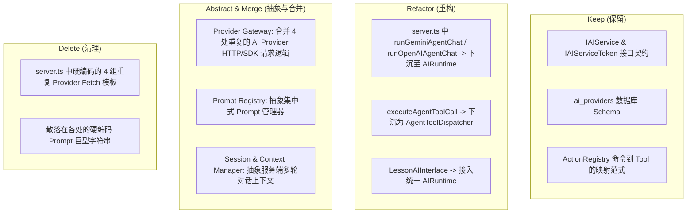

# OpenLearn AI Architecture Refactor Proposal (AI 架构重构方案建议)

> **重构目标**：基于对现有系统的审计结果，为下一阶段构建统一的 **OpenLearn AI Runtime (AI 运行时)** 奠定坚实的技术与架构方案。

---

## 1. 重构指导原则 (Core Refactoring Principles)

1. **统一 AI 统一入口 (Unified Provider Gateway)**：消除 `server.ts` 与 `packages/core/di/ai-service.ts` 之间重复的 Provider 查询、解密与 Fetch 请求逻辑。
2. **统一 Agent 运行时 (Unified Agent Runtime)**：将散落在 `server.ts` 中的 Agent 聊天循环、Function Calling 调度器、Tool 格式转换器抽离并下沉至核心 `ai-runtime` 包中。
3. **上下文持久化与流式响应 (Context & Streaming)**：支持多轮对话上下文在服务端的持久化存储，并引入 SSE / WebSocket 流式输出 (Streaming)。
4. **集中化 Prompt 管理 (Prompt Registry)**：建立统一的 Prompt 注册表，支持模版插值、多语言与动态配置。

---

## 2. 模块处置建议 (Risk Analysis & Module Disposition)



### 2.1 保留 (Keep)
- **`IAIService` 与 `IAIServiceToken`**：保留 DI 接口契约，确保插件与内核依赖注入不受影响。
- **`ai_providers` 数据库结构**：保留已有的加密密钥存储与 Provider 配置表结构。
- **Action 到 Tool 的自动映射思想**：保留从 `ActionRegistry` 自动导出 AI Tool 的优雅范式。

### 2.2 重构 (Refactor)
- **Agent Chat 逻辑下沉**：将 `server.ts` 中的 `runGeminiAgentChat` 与 `runOpenAIAgentChat` 从 HTTP 路由中剥离，下沉为标准的 `AIRuntimeKernel`。
- **Agent 工具执行器**：重构 `executeAgentToolCall`，使其成为可独立测试的 `AgentToolDispatcher` 子系统。

### 2.3 合并与抽象 (Merge & Abstract)
- **统一 Provider 网关 (`AIProviderGateway`)**：统一封装 OpenAI 兼容 HTTP 请求与 Gemini SDK 请求，全局只保留唯一一份 API Key 解密与请求推演逻辑。
- **统一 Prompt 注册表 (`PromptRegistry`)**：集中收拢系统 Agent 提示词、课表 OCR 提示词、学生评语提示词与 Lesson 生成提示词。
- **统一 Conversation 上下文管理器 (`ConversationContextManager`)**：支持多轮 Session 在服务端的加载、裁剪与持久化。

### 2.4 清理 (Delete)
- **清理 `server.ts` 中重复的 fetch 逻辑**（在 OCR 和学生评语接口中重复写的 Provider 请求代码）。
- **清理硬编码字符串 Prompt**。

---

## 3. 拟建 AI Runtime 目标架构预览 (Target AI Runtime Architecture)

```
packages/core/ai-runtime/
├── types.ts                      # 严格 TypeScript 类型定义
├── provider-gateway.ts           # 统一 Provider 网关 (OpenAI / Gemini / DeepSeek / Ollama)
├── prompt-registry.ts            # 集中式 Prompt 模板与构建器
├── conversation-manager.ts       # 多轮 Conversation / Context 内存与 DB 存储
├── tool-dispatcher.ts            # ActionRegistry 工具转换与 Tool 执行器
├── agent-runtime.ts              # Agent 核心循环 (支持 Streaming & Function Calling)
└── index.ts                      # 统一导出
```

---

## 4. 下一阶段 Action Plan (Next Steps)

按照本次审计结论，下一阶段将正式**设计并实现 OpenLearn AI Runtime (AI 运行时)**：
1. 建立 `packages/core/ai-runtime/` 内核模块。
2. 实现 `AIProviderGateway` 解决 4 处 Provider 重复请求问题。
3. 实现 `PromptRegistry` 集中管理所有 Prompt 模板。
4. 实现 `AgentRuntime` 与 `ConversationManager` 支持多轮对话与工具调度。
5. 将 `server.ts` 路由无缝切换接入新的 `AIRuntime`。
