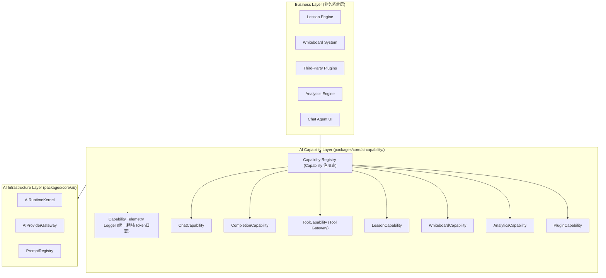

# OpenLearn AI Capability Layer Specification (AI 能力层规范)

## 1. Executive Summary (概述)

OpenLearn AI Capability Layer（AI 能力层）位于 `packages/core/ai-capability/` 目录下。作为业务系统（Lesson Engine、Whiteboard、Plugin System、Analytics Engine、Chat Agent）与底层的 AI Provider / AIRuntime 之间的**统一解耦抽象层**，能力层切断了业务系统对特定 AI 模型和 Provider HTTP API 的直接依赖。

---

## 2. Capability Architecture (Mermaid 架构图)

---

## 3. Standard Capability Interfaces (标准能力接口)

- **`ICompletionCapability`**: 基础快速文本补全。
- **`IChatCapability`**: 多轮会话与上下文管理。
- **`IToolCapability`**: 工具 gateway 与 Function Calling。
- **`ILessonCapability`**: 5 阶段教案生成、随堂测验生成、环节总结。
- **`IWhiteboardCapability`**: 画布图表生成、选中元素总结、对象释义、布局美化。
- **`IAnalyticsCapability`**: 教学 Insights 生成、教师建议生成、课后反思生成。
- **`IPluginCapability`**: 插件安全 Provider 隔离调用。
