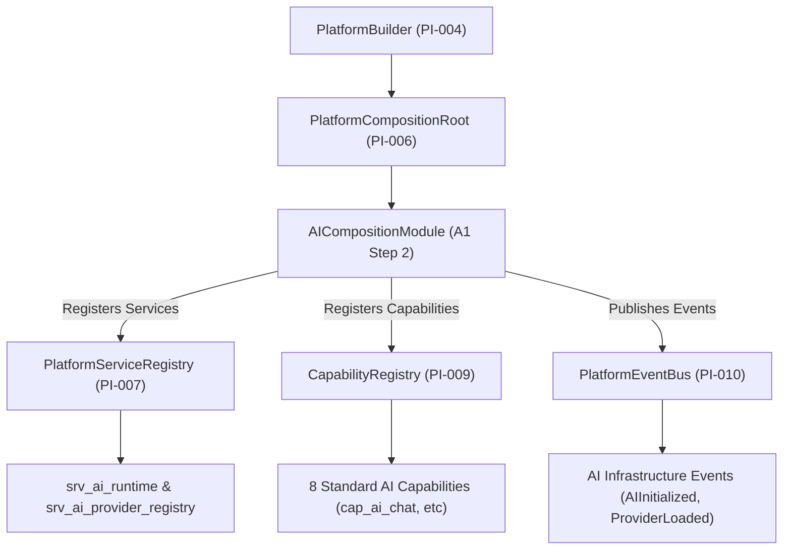

# OpenLearn AI Platform Integration Specification (AI 平台集成规范)

## 1. Executive Summary (概述)

在 Platform Adoption Sprint A1 Step 2 中，成功实现了 **AI Runtime Integration**。本步骤通过引入 `AICompositionModule` (`packages/core/bootstrap/composition/ai-composition-module.ts`)，成功将现有的 AI Runtime 和现存 8 大 AI 底层能力接轨至 Platform Kernel 的生命周期管理（`Initialize` → `Start` → `Ready` → `Shutdown` → `Dispose`），**在 100% 保留现存 AI 业务逻辑与 Tool / Prompt 调度机制前提下，完成了托管集成**。

---

## 2. Integration Architecture & Topology (Mermaid 平台集成架构图)

---

## 3. Registered AI Infrastructure Services & Capabilities (托管服务与能力清单)

- **Platform Services**: `srv_ai_runtime`, `srv_ai_provider_registry`
- **Capability Registry**: `cap_ai_chat`, `cap_ai_completion`, `cap_ai_streaming`, `cap_ai_tool_calling`, `cap_ai_embedding`, `cap_ai_planning`, `cap_ai_vision`, `cap_ai_reasoning`
- **Infrastructure Events**: `AIInitialized`, `ProviderLoaded`, `RuntimeStarted`
