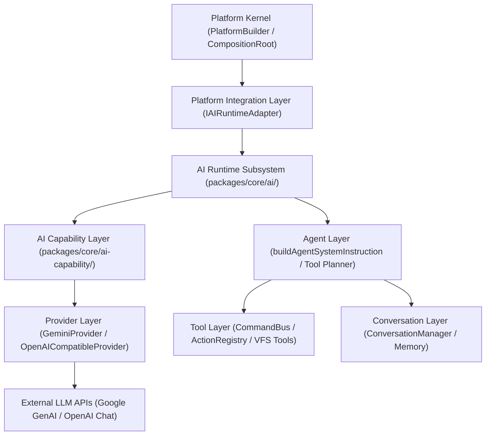

# OpenLearn AI Runtime Architecture Audit (AI 运行时架构审计)

## 1. Executive Summary (概述)

本报告是对 OpenLearn V2 项目中现存 AI 运行时（AI Runtime）与 AI 能力子系统（`packages/core/ai/` 及 `packages/core/ai-capability/`）的完整架构审计。

系统目前已具备高度分层与模块化的 AI 能力架构，通过统一适配器模式支持外部多 LLM Provider（Google Gemini, OpenAI compatible endpoints），并包含对话上下文管理、提示词构建、工具分发以及基础流式响应支持。

---

## 2. Layered Architecture Topology (分层架构拓扑图)

---

## 3. Layer Responsibilities (各层核心职责分析)

1. **Integration Layer (`IAIRuntimeAdapter`)**:
   - 作为 Platform Kernel 与 AI Runtime 的唯一解耦契约接口，暴露 `generateText()`, `health()`, `metadata()` 等标准生命周期与操作入口。

2. **AI Capability Layer (`packages/core/ai-capability/`)**:
   - 暴露标准化 8 大底层 AI 能力描述符（Chat, Completion, Streaming, ToolCalling, Embedding, Planning, Vision, Reasoning）。

3. **Provider Layer (`packages/core/ai/provider/`)**:
   - 封装与外部 LLM API（Google Gemini API, OpenAI Chat Completions API）的网络通信、凭证加密/解密、超时重试与错误归一化。

4. **Agent Layer & System Instruction (`server.ts` & `packages/core/ai/runtime/`)**:
   - 负责解析教师/学生指令，生成角色导向的系统 Prompt（`buildAgentSystemInstruction`），调度工具分发逻辑。

5. **Tool Layer (`packages/core/ai/tool/`)**:
   - 连接 AI Agent 与底层 CommandBus、ActionRegistry 及 VFS 工具（`class_create`, `student_create`, `vfs.*` 等）。

6. **Conversation & Memory Layer (`packages/core/ai/conversation/` & `memory/`)**:
   - 管理对话上下文历史记录、消息打包（`buildAgentFinalMessage`）、附件提取与内存/SQLite 存储。
