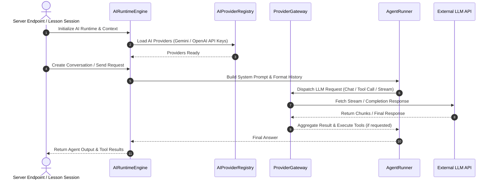

# OpenLearn AI Runtime Lifecycle Analysis (AI 运行时生命周期分析报告)

## 1. Executive Summary (概述)

本报告分析现存 AI Runtime 的完整的生命周期过程：初始化、服务注册、Provider 加载、对话创建、请求处理、流式响应、关闭与资源清理。

---

## 2. Sequence Diagram (生命周期时序图)

---

## 3. Lifecycle Stages (生命周期阶段详解)

1. **Initialization (初始化)**: 环境变量解析 (`GEMINI_API_KEY`) & SQLite `ai_providers` 表结构就绪。
2. **Provider Loading (Provider 加载)**: 动态解密 API Key 并实例化对应的 SDK/HTTP 客户端。
3. **Conversation Creation (对话创建)**: 建立具有唯一 `conversationId` 的上下文历史句柄。
4. **Request Processing (请求处理)**: 结合 Lesson / Classroom 环境变量，渲染角色 System Prompt，拼接用户输入与附件。
5. **Streaming (流式响应)**: 逐 Chunk 提取 Server-Sent Events (SSE) 或 WebSocket 广播。
6. **Shutdown & Cleanup (关闭清理)**: 销毁句柄，擦除内存敏感密钥。
