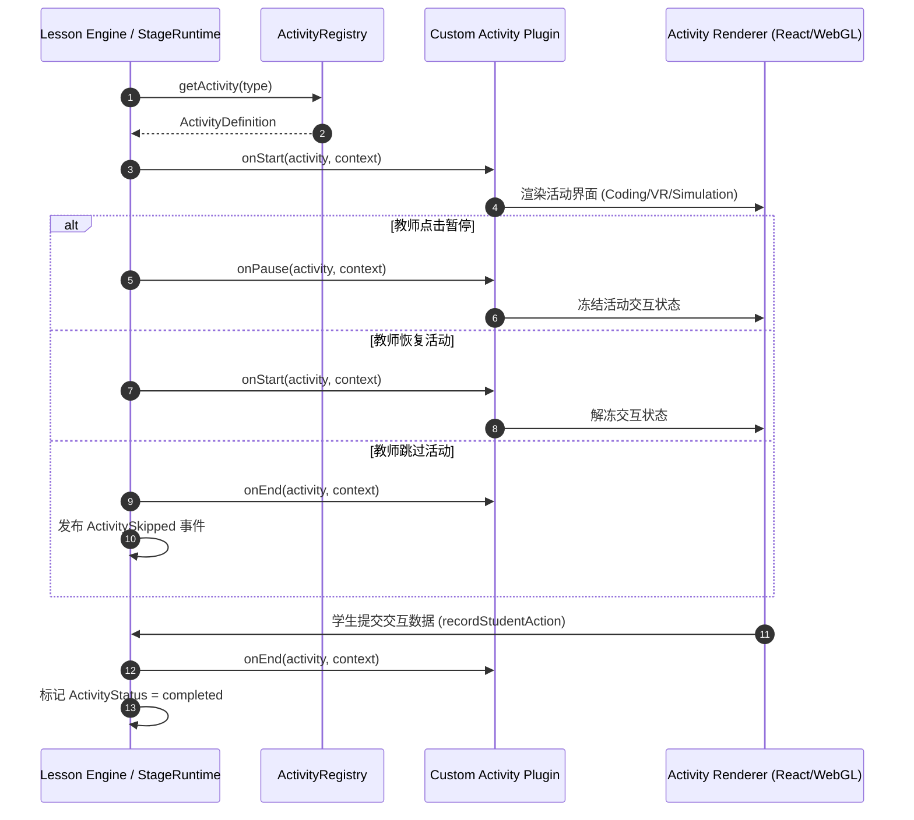

# OpenLearn Activity SDK & Plugin Specification (教学活动 SDK)

## 1. Overview (概述)

`ActivityRegistry` 为 OpenLearn 提供了极具扩展性的活动插件体系。所有的教学活动（如播放视频、展示图片、运行 Python、开始 Quiz、开始讨论、AI 生成问题、网页浏览、GeoGebra 演示等）均注册在 Activity Registry 中。

通过此 SDK，第三方开发者或系统插件可以轻松扩充全新的 Activity 类型（如 **Coding Activity**, **Simulation Activity**, **VR Activity**, **MindMap Activity**），而**无需修改 Lesson Engine 的任何核心代码**。

---

## 2. Activity Execution Flow (Mermaid 活动执行流程)



---

## 3. Registering Custom Activities (注册自定义活动)

插件开发者在插件 `activate(ctx)` 生命周期中调用 `registerActivity`：

```typescript
import { ActivityRegistry, ActivityDefinition } from '@openlearn/plugin-sdk';

const VRActivityDef: ActivityDefinition = {
  type: 'vr_space_exploration',
  name: 'VR 3D 太阳系探秘',
  description: 'WebXR 沉浸式太空三维物理仿真',
  category: 'simulation',
  defaultConfig: {
    timeoutSeconds: 600,
    allowStudentInteraction: true,
  },
  onStart: async (activity, context) => {
    console.log('[VRActivity] 启动 VR 引擎:', activity.title);
  },
  onPause: async (activity, context) => {
    console.log('[VRActivity] 暂停 VR 交互');
  },
  onEnd: async (activity, context) => {
    console.log('[VRActivity] 结束并回收 3D 渲染上下文');
  },
};

// 注册至全局注册表
activityRegistry.registerActivity(VRActivityDef);
```

---

## 4. Built-in Activity Types (内置活动类型表)

| Activity Type | 名称 | 分类 | 默认能力 |
|---|---|---|---|
| `video` | 播放视频 | `media` | HLS/MP4 播放控制 |
| `image` | 展示图片 | `media` | 高清图表与手势缩放 |
| `python` | 运行Python | `coding` | Pyodide 在线代码执行 |
| `quiz` | 开始Quiz | `assessment` | 随堂选择/填空题即时提交 |
| `discussion` | 开始讨论 | `collaboration` | 实时文本/语音讨论面板 |
| `ai_question` | AI生成问题 | `ai` | AI 动态提问与评分 |
| `web_browse` | 网页浏览 | `custom` | 安全沙箱网页嵌入 |
| `geogebra` | GeoGebra演示 | `simulation` | 三维数学逻辑与几何模型 |
| `mindmap` | 思维导图 | `collaboration` | 节点扩展与协作脑图 |
| `simulation` | 科学实验模拟 | `simulation` | 物理化学交互仿真 |
| `vr` | VR沉浸式体验 | `simulation` | WebXR 3D 虚拟现实 |
