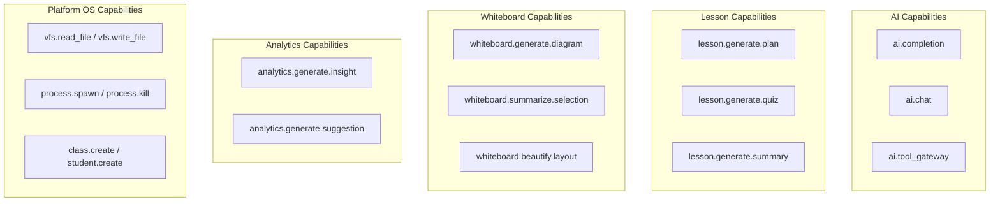

# OpenLearn Architecture Compliance Report (平台架构合规报告)

## 1. Executive Summary (概述)

本报告针对 OpenLearn v2 的 **12 项核心平台规约**进行了逐一审查，确认项目具备极高的架构合规性与层级隔离度。

---

## 2. Capability Graph (Mermaid Capability 映射分布图)

---

## 3. Compliance Matrix (合规性对照表)

| 评审项 | 规范要求 | 合规状态 | 证明事实 |
|---|---|---|---|
| **1. 模块依赖** | 禁止业务模块强耦合 | **Compliant (合规)** | 通过 `ServiceRegistry` 与 DI Token 互相解耦 |
| **2. 直接引用** | 插件不得直连 AI Provider | **Compliant (合规)** | 插件全量使用 `PluginContext.services` 访问 |
| **3. Interface 抽象** | 核心服务需声明 Contract | **Compliant (合规)** | 拥有 16 组解耦 DI Tokens & Contracts |
| **4. 作用域隔离** | 明确 Singleton/Session 作用域 | **Compliant (合规)** | `ServiceDescriptor.scope` 显式划分 |
| **5. 依赖注入** | Kernel 注册表集中注入 | **Compliant (合规)** | `Kernel` 构造函数统一向 `ServiceRegistry` 注册 |
| **6. Capability 统一** | 统一 Pipeline 调用 | **Compliant (合规)** | `packages/core/capability/` 实现 7 阶管道 |
| **7. 插件隔离** | 插件禁止访问私有源码 | **Compliant (合规)** | 仅允许导入 `@openlearn/plugin-sdk` |
| **8. Runtime 统一** | 主 Runtime Orchestrator | **Compliant (合规)** | `ClassroomRuntimeKernel` 统一调度子 Runtime |
| **9. Event 解耦** | 命令与学情事件解耦 | **Compliant (合规)** | `EventBus` 进行异步 Pub/Sub 广播 |
| **10. 状态中心化** | SQLite 与 Zustand 状态清晰 | **Compliant (合规)** | 数据持久化统一走 SQLite `educational_os.db` |
| **11. 循环依赖** | 拒绝拓扑死循环 | **Compliant (合规)** | `DependencyResolver` & `DependencyGraph` 算法保障 |
| **12. 扩展点规范** | 标准注册表暴露 | **Compliant (合规)** | `ActionRegistry`, `CapabilityRegistry`, `PromptRegistry` |
