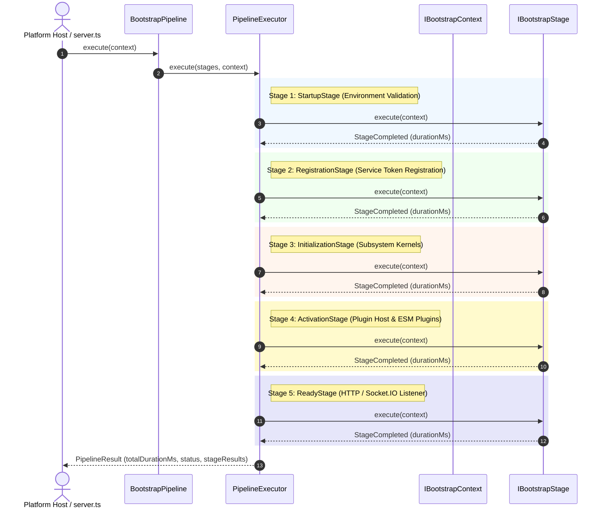

# OpenLearn Bootstrap Pipeline Specification (平台启动管道规范)

## 1. Executive Summary (概述)

`BootstrapPipeline` (`packages/core/bootstrap/pipeline/`) 是 Platform Composition Root 的核心执行引擎，负责按严格顺控关系执行平台启动、服务注册、能力装配、插件激活、就绪监听与优雅关机。

在 PI-003 中，**保留并包装现有的启动逻辑**，提供流式时序采集、结构化日志输出、诊断事件通知与异常自动回滚机制。

---

## 2. Platform Bootstrap Pipeline (Mermaid 启动管道流程图)



---

## 3. Class & Interface API Specifications (API 详细说明)

### 3.1 `IBootstrapStage` (阶段契约)
```typescript
export interface IBootstrapStage {
  readonly id: string;
  readonly name: PlatformStage | string;
  readonly description: string;
  readonly timeoutMs?: number;
  execute(context: IBootstrapContext): Promise<void>;
  rollback?(context: IBootstrapContext): Promise<void>;
}
```

### 3.2 `PipelineExecutor` (执行器)
- 顺序调度 `IBootstrapStage` 列表。
- 捕获单阶段超时与致命异常，并在失败时反向触发已执行阶段的 `rollback(context)` 钩子。
- 输出结构化控制台日志：`[Platform] Entering StartupStage ... Completed StartupStage (8 ms)`。
- 派发轻量级诊断事件（`PipelineStarted`, `StageStarted`, `StageCompleted`, `StageFailed`, `PipelineCompleted`）。

### 3.3 `PipelineResult` (执行结果)
```typescript
export interface PipelineResult {
  readonly totalDurationMs: number;
  readonly status: PipelineStatus; // 'Success' | 'Failed' | 'Aborted'
  readonly stageResults: ReadonlyArray<StageExecutionResult>;
  readonly failedStage?: string;
  readonly error?: Error;
}
```
