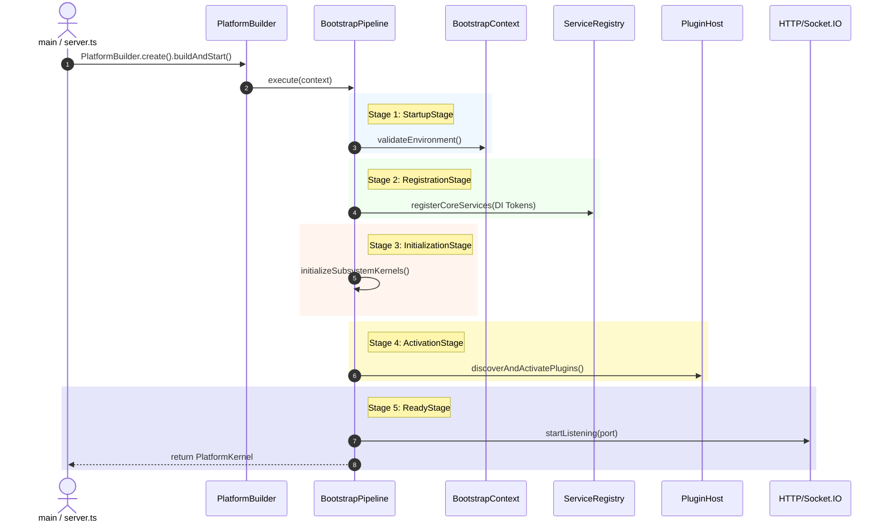

# OpenLearn Bootstrap Pipeline Specification (平台启动管道规范)

## 1. Executive Summary (概述)

`BootstrapPipeline` 是 Platform Composition Root 的核心执行引擎，负责按严格顺控关系执行平台启动、服务注册、能力装配、插件激活、就绪监听与优雅关机。

---

## 2. Platform Bootstrap Pipeline (Mermaid 启动管道流程图)

---

## 3. Pipeline Stage Execution Rules (阶段执行准则)

1. **强顺序依赖**: 任阶段抛出致命异常，立即终止后续阶段，触发 `ShutdownStage` 释放前置资源。
2. **状态只读保护**: 启动上下文 `BootstrapContext` 在进入 `ReadyStage` 后自动冻结，防止运行期随意突变配置。
