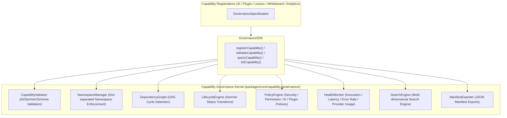

# OpenLearn Capability Governance Master Specification (能力治理主规范)

## 1. Executive Summary (概述)

`CapabilityGovernanceKernel` 位于 `packages/core/capability-governance/` 目录下。该子系统在平台内核层建立起覆盖全生命周期的 Capability 治理规则，防止 Namespace 冲突、依赖依赖循环、无主插件越权及缺乏监控的“暗黑 API”。

---

## 2. Capability Governance (Mermaid 治理架构图)

---

## 3. Core Governance Pillars (治理八大支柱)

1. **Namespace 规范化**: 点分式单向命名，防碰撞。
2. **依赖图与拓扑循环检测**: DAG 式依赖判定，杜绝死循环。
3. **SemVer 语义生命周期**: 6 阶段严格状态机切换。
4. **统一策略引擎**: 权限策略、安全策略、AI 策略及插件策略。
5. **审批防越权机制**: Official / Community / Experimental / Internal 四级隔离。
6. **全维度健康监控**: 统计 Success Rate, Latency, Error Rate 与 Provider 使用率。
7. **多维搜索引擎**: 模糊/精确关键字、标签、Provider 及 Namespace 检索。
8. **JSON Manifest 标准导出**: 为插件和能力目录生成标准 Manifest。
