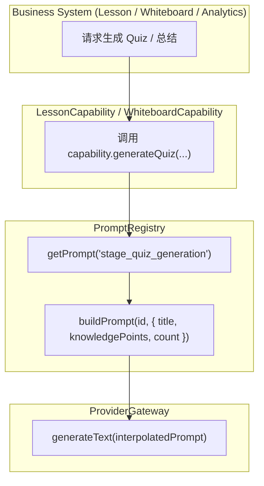

# OpenLearn Capability Integration Specification (AI 能力整合规范)

## 1. Overview (概述)

整合规范定义了 Lesson Engine、Whiteboard System、Analytics Engine 与 Plugin Framework 如何通过 Capability 接入 AI 基础设施，彻底断绝业务直接请求 HTTP Endpoint 的风险。

---

## 2. Prompt Flow (Mermaid Prompt 检索与插值流向图)

---

## 3. Subsystem Integrations (领域集成矩阵)

| 领域模块 | 推荐接入的 Capability | API 实例 |
|---|---|---|
| **Lesson Engine** | `ILessonCapability` | `generateLessonPlan()`, `generateQuiz()`, `generateSummary()` |
| **Whiteboard** | `IWhiteboardCapability` | `generateDiagram()`, `summarizeSelection()`, `explainObject()`, `beautifyLayout()` |
| **Analytics Engine** | `IAnalyticsCapability` | `generateInsight()`, `generateSuggestion()`, `generateReflection()` |
| **Plugin Systems** | `IPluginCapability` | `invokeAI(pluginId, prompt, options)` |
