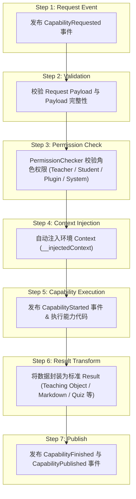
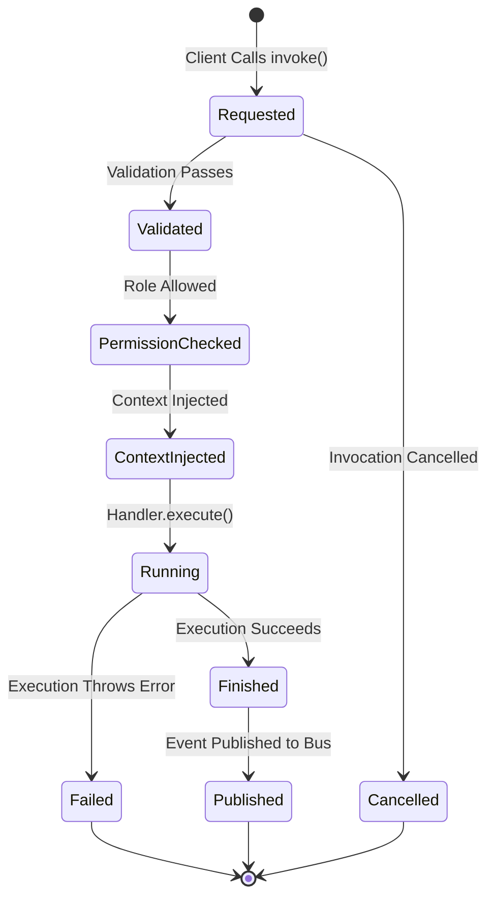

# OpenLearn Capability Invocation Specification (能力调用与管道规范)

## 1. Overview (概述)

`InvocationEngine` 与 `CapabilityPipeline` 负责处理 Capability 的 7 阶段标准执行管道（Request → Validation → Permission → Context Injection → Capability → Result Transform → Publish），并提供 `invoke`, `batch`, `retry`, `schedule`, `cancel` 等丰富调用语义。

---

## 2. Invocation Pipeline (Mermaid 7 阶段管道图)

---

## 3. Capability Lifecycle (Mermaid 生命周期图)

