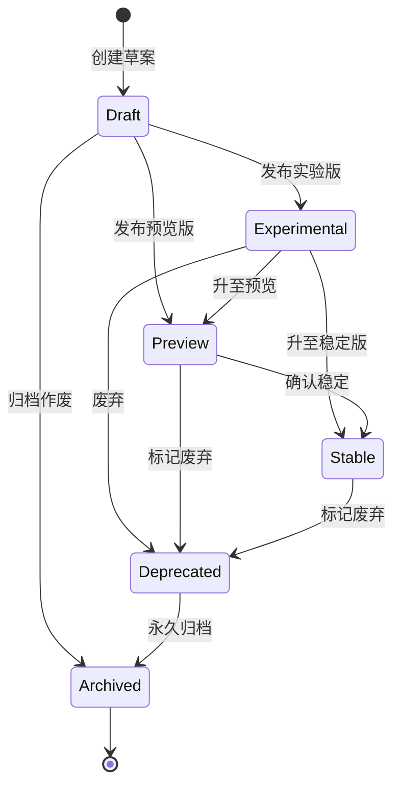
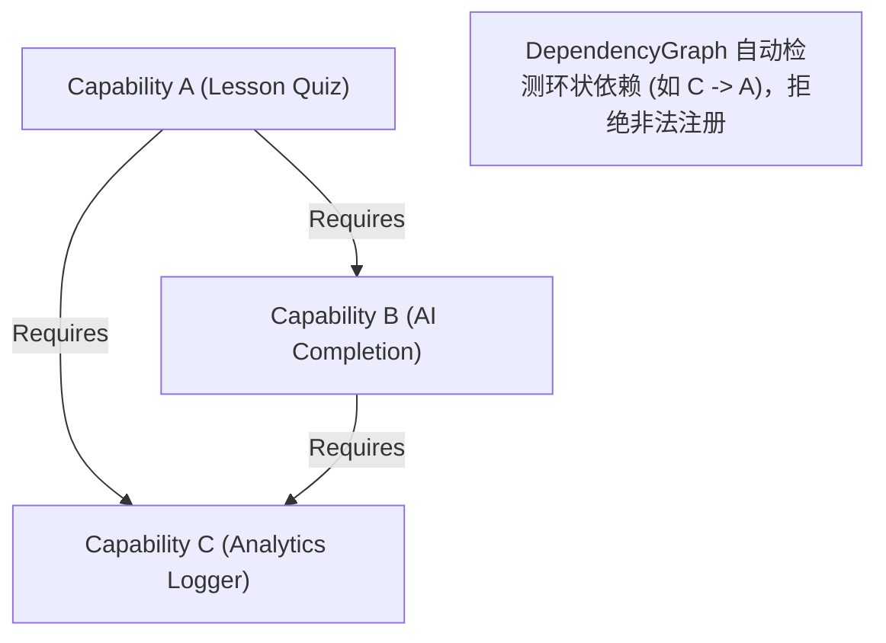

# OpenLearn Capability Lifecycle & Dependency Specification (能力生命周期与依赖图规范)

## 1. Executive Summary (概述)

规范定义了 Capability 从草案 (`Draft`) 到归档 (`Archived`) 的 6 阶段转换状态机，以及 DAG 依赖树拓扑循环检测规则。

---

## 2. Capability Lifecycle (Mermaid 生命周期状态机图)

---

## 3. Capability Dependency Graph (Mermaid 依赖图示例)

