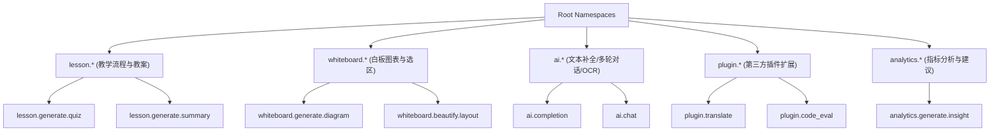

# OpenLearn Capability Namespace Specification (能力命名空间规范)

## 1. Executive Summary (概述)

为了防止各模块能力名称发生冲突，平台推行**点分式命名空间规范 (Dot-separated Namespace)**。

---

## 2. Capability Namespace (Mermaid 命名空间层级图)

---

## 3. Namespace Syntax Rules (命名规则)

- 统一采用小写字母、数字与下划线，使用英文句号分隔：`[domain].[action].[subject]`
- 正式注册前由 `NamespaceManager` 进行正则表达与碰撞断言。
