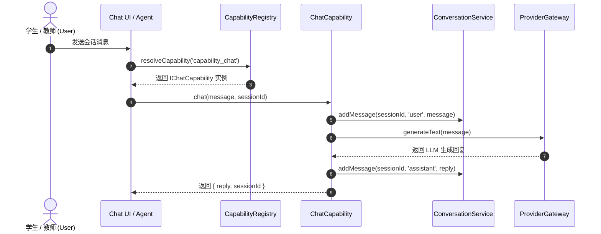

# OpenLearn Capability Registry Specification (AI 能力注册表规范)

## 1. Overview (概述)

`CapabilityRegistry` 是 AI 能力层的核心注册中心，支持标准能力与第三方插件能力（如 `MathCapability`, `CodingCapability`, `TranslationCapability`）的动态注册与依赖解析。

---

## 2. Conversation Flow (Mermaid 会话流向图)



---

## 3. Dynamic Registration (动态扩展 API)

插件可以通过 `IAICapabilityServiceToken` 获取 `AICapabilityKernel` 并注册扩展能力：

```typescript
import { IAICapability } from '@openlearn/plugin-sdk';

const mathCapability: IAICapability = {
  meta: {
    id: 'capability_math',
    name: 'Math Solver Capability',
    type: 'math',
    description: 'Solves complex math formulas',
    version: '1.0.0',
  },
};

kernel.aiCapability.registry.registerCapability(mathCapability);
```
