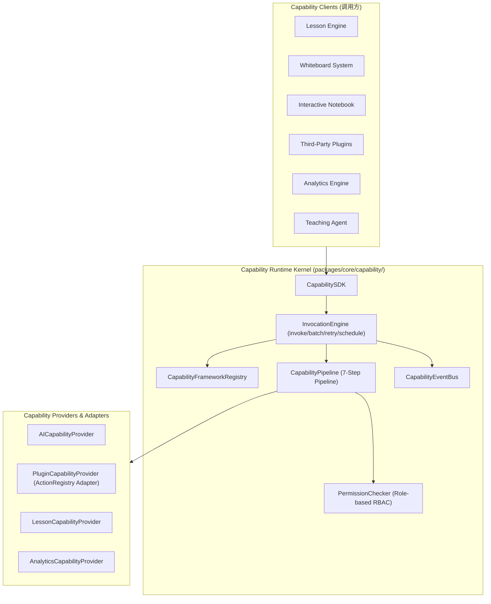

# OpenLearn Capability Runtime Specification (能力运行时规范)

## 1. Executive Summary (概述)

OpenLearn Capability Runtime 位于 `packages/core/capability/` 目录下。作为平台内核级（Platform Kernel）能力调用框架，该运行时建立了统一的 Capability Descriptor、管道校验、角色权限控制、环境与 Context 注入、统一结果转换与事件发布流。系统中的 Lesson Engine、Whiteboard、Notebook、Plugins、Analytics Engine 及 AI 模块全部通过 Capability 进行标准化协作通信。

---

## 2. Capability Architecture (Mermaid 架构图)



---

## 3. Capability Descriptor Standard (描述符标准)

所有注册的能力均需声明标准 `CapabilityDescriptor`：

```typescript
export interface CapabilityDescriptor {
  readonly id: string;
  readonly name: string;
  readonly category: CapabilityCategory; // lesson | whiteboard | notebook | plugin | analytics | ai
  readonly provider: string;
  readonly permission: ReadonlyArray<CapabilityRole>; // Teacher | Student | Plugin | AI | Observer | System
  readonly inputSchema: Record<string, unknown>;
  readonly outputSchema: Record<string, unknown>;
  readonly metadata: Record<string, unknown>;
  readonly tags: ReadonlyArray<string>;
  readonly version: string;
}
```
