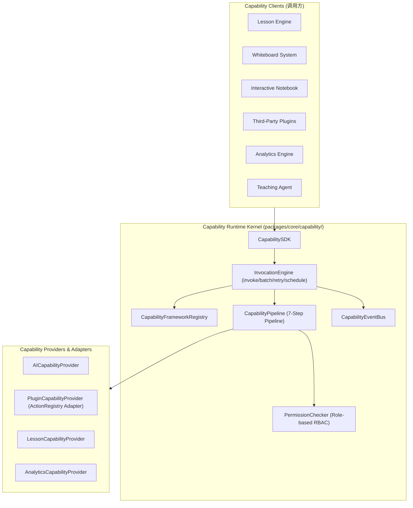

# OpenLearn Capability Runtime Specification (能力运行时规范)

## 1. Executive Summary (概述)

OpenLearn Capability Runtime 位于 `packages/core/capability/` 目录下。作为平台内核级（Platform Kernel）能力调用框架，该运行时建立了统一的 Capability Descriptor、管道校验、角色权限控制、环境与 Context 注入、统一结果转换与事件发布流。系统中的 Lesson Engine、Whiteboard、Notebook、Plugins、Analytics Engine 及 AI 模块全部通过 Capability 进行标准化协作通信。

---

## 2. Capability Architecture (Mermaid 架构图)



---

## 3. Capability Descriptor Standard (描述符标准)

所有注册的能力均需声明标准 `CapabilityDescriptor`：

```typescript
export interface CapabilityDescriptor {
  readonly id: string;
  readonly name: string;
  readonly category: CapabilityCategory; // lesson | whiteboard | notebook | plugin | analytics | ai
  readonly provider: string;
  readonly permission: ReadonlyArray<CapabilityRole>; // Teacher | Student | Plugin | AI | Observer | System
  readonly inputSchema: Record<string, unknown>;
  readonly outputSchema: Record<string, unknown>;
  readonly metadata: Record<string, unknown>;
  readonly tags: ReadonlyArray<string>;
  readonly version: string;
}

---

## PI-009 Addendum — Capability Runtime Module (`packages/core/capability-runtime/`)

> **Distinction:** The runtime documented above (under `packages/core/capability/`) is the
> platform **capability invocation framework** (descriptor, 7-step pipeline, role/permission
> governance, events). **PI-009** introduces a separate, self-contained **Capability Runtime**
> module at `packages/core/capability-runtime/` that owns capability *registration, resolution,
> and lifecycle* as a first-class kernel subsystem. The two coexist; the PI-009 module does
> **not** duplicate or replace the invocation framework.

### PI-009 Public Surface

| Class | Responsibility |
|---|---|
| `CapabilityStatus` | Lifecycle state machine: `Registered → Resolved → Active ⇄ Inactive`, plus `Disabled` / `Disposed`. |
| `CapabilityDescriptor` | Immutable metadata (id, name, version, category, provider, contract, priority, dependencies, metadata) + `activator`. |
| `CapabilityProvider` | Activation abstraction (`Single`/`Multiple`/`Priority`/`Default`); owns the `activator`. |
| `CapabilityContext` | Passed to an `activator`; resolves sibling capabilities/services, records diagnostics, detects cycles. |
| `CapabilityResolver` | Resolves `Single`/`Optional`/`Validation` (by id) and `Multiple`/`Priority`/`Default` (by contract). |
| `CapabilityRegistry` | Source of truth: `register`/`unregister`/`replace`/`exists`/`find`/`list`, duplicate detection. |
| `PlatformCapability` | Runtime wrapper binding descriptor + provider, caching the activated instance & status. |
| `CapabilityRuntime` | Top-level orchestrator integrating `PlatformServiceRegistry`, `PlatformContainer`, and `PlatformBuilder`. |

### Integration Points (PI-009)

- **`PlatformServiceRegistry`** — every activator-backed capability is also registered as a
  platform service (lazy factory), so the registry remains the single source of truth.
- **`PlatformContainer` (PI-008)** — when supplied, capabilities are mirrored as DI services,
  letting capabilities participate in the dependency-injection graph.
- **`PlatformBuilder`** — `CapabilityRuntime.attachBuilder(source)` accepts a builder's
  `capabilityCatalog` for cross-referencing (`isBuilderAware(id)`).
```
