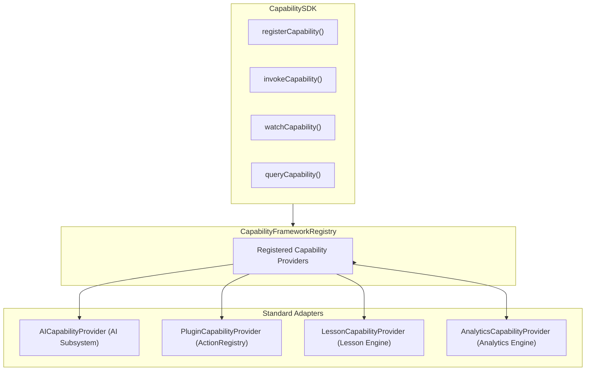

# OpenLearn Capability SDK Specification (能力 SDK 规范)

## 1. Overview (概述)

`CapabilitySDK` 提供了面向开发者、第三方插件、AI Agent 及系统模块的离散化与高阶 API。

---

## 2. Provider Graph (Mermaid Provider 关系图)



---

## 3. SDK API Reference (API 参考)

### 3.1 注册能力 (registerCapability)
```typescript
sdk.registerCapability(myHandler);
```

### 3.2 调用能力 (invokeCapability)
```typescript
const result = await sdk.invokeCapability('cap_ai_completion', { prompt: 'Hello' }, { actorRole: 'Teacher' });
```

### 3.3 监听生命周期事件 (watchCapability)
```typescript
const unsubscribe = sdk.watchCapability('CapabilityFinished', (event) => {
  console.log('Finished:', event.payload.result);
});
```

### 3.4 查询与发现能力 (queryCapability)
```typescript
const lessonCaps = sdk.queryCapability('lesson');
```
