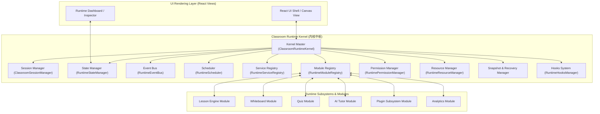
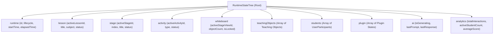

# OpenLearn Classroom Runtime Architecture (课堂运行时架构)

## 1. Overview (概述)

OpenLearn Classroom Runtime（课堂运行时）是 OpenLearn 教学 OS 的底层内核控制中枢。

系统确立了**“UI 仅为 View，一切皆运行于 Runtime”** 的底层范式：
- React UI 仅负责渲染 UI 视图与捕捉用户交互。
- 整个课堂的状态、生命周期、服务调度、事件流、资源分配、插件钩子、数据快照与崩溃恢复，**全量由 Classroom Runtime 独立管理与维护**。
- 未来所有模块——**Lesson**, **Whiteboard**, **Plugin**, **Quiz**, **AI**, **Learning Analytics**, **Collaboration** 均无一例外运行在 Classroom Runtime 统一骨干之上。

---

## 2. Runtime Architecture (Mermaid 架构图)

---

## 3. Runtime State Tree (Mermaid 状态树图)

Classroom Runtime 维护全局唯一的不可变状态树 (Unified State Tree)，结构如下：

---

## 4. Key Runtime Concepts (核心概念)

1. **Decoupled Event Pipeline**: 模块间禁止直接硬编码方法调用，一律通过 `RuntimeEventBus` 广播与订阅解耦事件（如 `SessionCreated`, `StudentJoined`, `StageChanged`, `ObjectUpdated`, `AIFinished`）。
2. **Priority Task Scheduler**: 提供 `Immediate`, `High`, `Normal`, `Low`, `Idle` 五级优先度的异步任务队列，保障高优先级课堂事件（如阶段跳转、锁定控制）毫秒级响应。
3. **Unified Security & Permissions**: 针对 `Teacher`, `Assistant`, `Student`, `Observer`, `Plugin`, `AI` 统一执行鉴权校验。
4. **Crash Recovery & Snapshots**: 引擎定时捕捉全量 Snapshot，发生网络中断或浏览器崩溃时可实现零损耗恢复。
