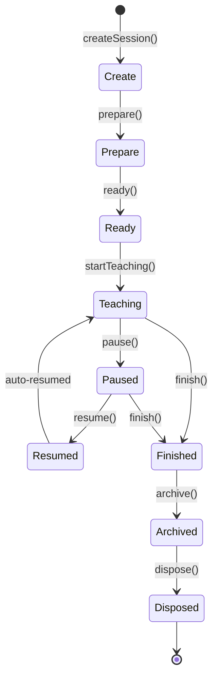

# OpenLearn Classroom Runtime Specification (课堂运行时集中编排规范)

## 1. Executive Summary (概述)

在 Product Phase Sprint P4-01 中，成功完成了 **Central Classroom Runtime**（位于 `src/features/classroom-runtime/`）的集中组装。

课堂运行时作为 OpenLearn 平台的核心中央运行时，统一协调并托管 6 大子运行时（`Lesson Runtime`, `Whiteboard Runtime`, `AI Runtime`, `Plugin Runtime`, `Analytics Runtime`, `Resource Runtime`）。通过 `ClassroomSession` 维护高度统一的 9 阶段生命周期状态机 (`Create` → `Prepare` → `Ready` → `Teaching` → `Paused` → `Resumed` → `Finished` → `Archived` → `Disposed`)，零破坏底层业务逻辑，同时向第三方插件开放 Widget 注册、服务挂载与 Action Extension 扩展能力。

---

## 2. 9-Stage Classroom Lifecycle State Machine (9 阶段生命周期拓扑)



---

## 3. Coordinated Runtimes & Contracts (托管 6 大运行时)

`ClassroomContext` 集中关联并向外部暴露 6 大子系统运行时句柄：

1. **Lesson Runtime**: 课堂会话描述符与教学大纲
2. **Whiteboard Runtime**: 2D Konva 画布渲染引擎与工具系统
3. **AI Runtime**: LLM 实时助教与 Agent 调度内核
4. **Plugin Runtime**: 沙箱托管与贡献注册表
5. **Analytics Runtime**: 遥测数据收集与学情诊断
6. **Resource Runtime**: 13 种教学资源解析与 Widget 嵌入

---

## 4. Classroom Runtime & Plugin Extension Usage Example (使用与插件扩展范例)

```typescript
import {
  ClassroomService,
} from './src/features/classroom-runtime/index.js';

const service = new ClassroomService();

// 1. Create Session
const session = service.createSession('cls_math_101');

// 2. Attach Sub-runtimes
session.attachRuntimes({
  lessonSession: { id: 'ls_1' },
  whiteboardEngine: { id: 'wb_1' },
  aiRuntime: { id: 'ai_1' },
  pluginHost: { id: 'ph_1' },
  analyticsEngine: { id: 'an_1' },
  resourceRegistry: { id: 'rr_1' },
});

// 3. Register Plugin Extension
service.getRegistry().registerActionExtension({
  id: 'action_plugin_reward_badge',
  name: 'Grant Badge Action',
  handler: (ctx) => {
    console.log('Granting badge in classroom:', ctx.classroomId);
  },
});

// 4. Drive 9-stage lifecycle
session.prepare();
session.ready();
session.startTeaching();
session.pause();
session.resume();
session.finish();
session.archive();
session.dispose();
```
