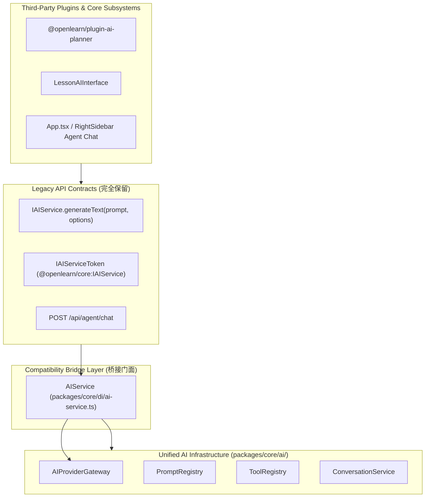

# OpenLearn AI Infrastructure Compatibility Guide (兼容性保障指南)

## 1. Overview (概述)

为了保障第三方插件与已有系统模块的零修改运行，重构采用了**门面模式 (Facade Pattern)** 与 **桥接模式 (Bridge Pattern)** 构建兼容层。

---

## 2. Compatibility Layer (Mermaid 兼容层结构图)

---

## 3. Backwards Compatibility Rules (向后兼容规则)

1. **零破坏性变更 (Zero Breaking Changes)**: `IAIService` 的 `generateText(prompt: string, options?: { systemInstruction?: string; temperature?: number })` 签名完全保留。
2. **数据表与环境变性保持原样**:
   - SQLite 数据库表 `ai_providers`（包含 `api_url`, `api_key`, `model_name`）依然作为 Provider 的存储真理源。
   - 环境变量 `GEMINI_API_KEY` 依然作为全局统一兜底源。
3. **插件无感升级 (Seamless Plugin Upgrade)**: 所有实现 `PluginContext.services.aiService` 的插件无需重新编译或更改代码。
