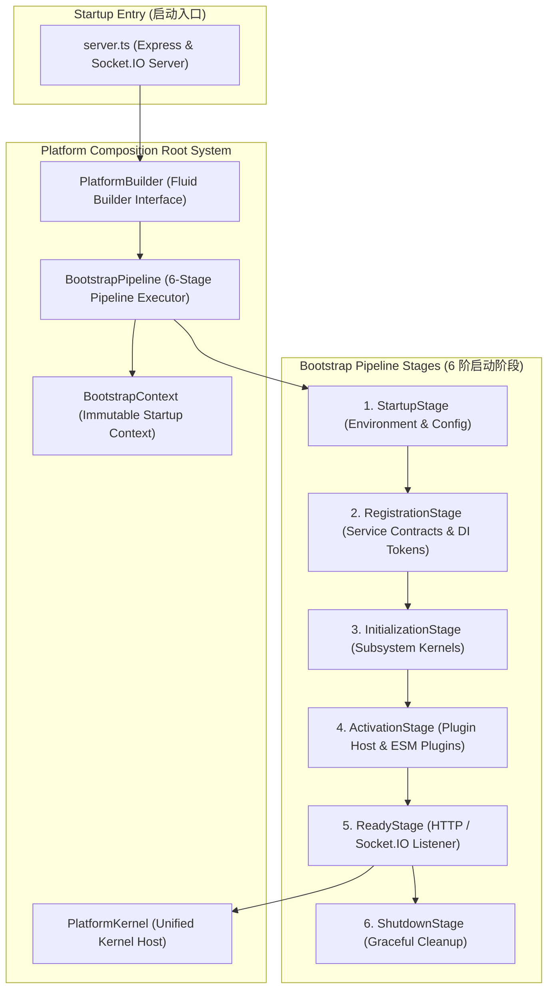

# OpenLearn Platform Composition Root Design (平台组合根设计规范)

## 1. Executive Summary (概述)

本设计规范定义了 OpenLearn v2 平台的 **Platform Composition Root (平台组合根)** 架构。组合根作为整个 Platform Kernel 的唯一启动与对象图装配入口，消除了分散在 `server.ts` 和 `Kernel` 构造函数中的硬编码对象实例化与无序依赖建立。

在本 Architecture Sprint (K1-A) 中，**未修改任何源代码**，仅产出权威架构规范，为后续 K1-B 实施做好准备。

---

## 2. Composition Root Architecture (Mermaid 组合根架构图)

---

## 3. Core Component Responsibilities (核心组件职责)

1. **`PlatformBuilder`**: 提供链式流畅构建接口（例：`PlatformBuilder.create().withConfig(cfg).usePlugin(p).buildAndStart()`）。
2. **`BootstrapPipeline`**: 执行 6 阶按序初始化管道，确保前置依赖完全 Ready 后才进入下一阶段。
3. **`BootstrapContext`**: 线程安全且只读的启动上下文，包含环境配置、调试日志与初始化状态。
4. **`PlatformKernel`**: 封装运行期所有的 Subsystem Kernels（Lesson, Whiteboard, Presence, Collaboration, Analytics, AI, Storage, Plugins），对外暴露标准的生命周期方法。
