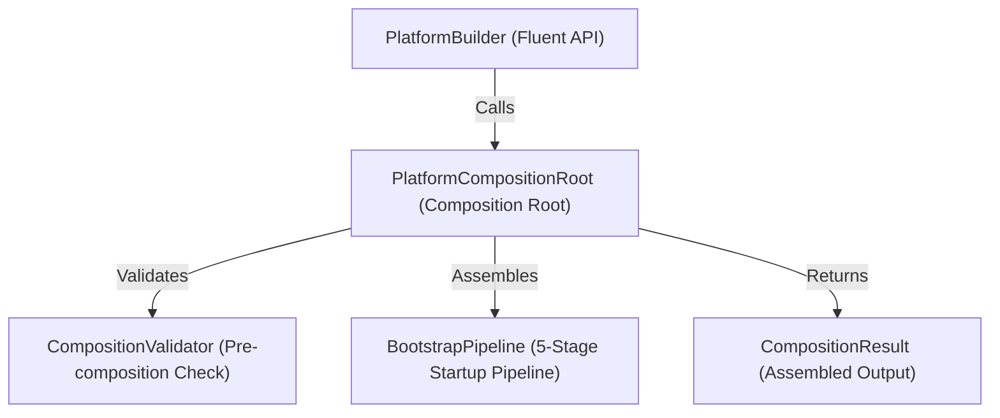

# OpenLearn Platform Composition Root Specification (平台组合根规范)

## 1. Executive Summary (概述)

`PlatformCompositionRoot` (`packages/core/bootstrap/composition/`) 为 Platform Kernel 提供了唯一的依赖组装入口 (Composition Root)。系统所有的底层基础设施依赖（Logger, Configuration, Environment, Bootstrap Pipeline, Platform Context, Existing Infrastructure References）均统一在此收拢组装。

在 PI-006 中，**组合根只负责依赖的组装（Composition），绝对不执行业务逻辑，绝对不初始化业务引擎模块（Plugin Host, Lesson Engine, Whiteboard, Analytics, AI Runtime）**。业务引擎模块继续由现有的启动流程托管初始化。

---

## 2. Composition Architecture (Mermaid 组合根架构图)

---

## 3. Composition State Machine (状态机)

`PlatformCompositionRoot` 内部状态严格按照下列次序流转：
`Created` → `Validating` → `Composing` → `Composed` → `Disposed`

当处于 `Composed` 或 `Disposed` 状态时，禁止再次注册模块，确保组合图的强只读保护。
