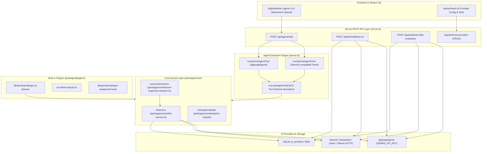
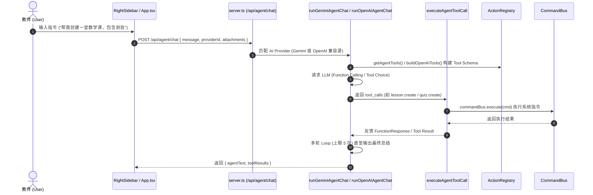

# OpenLearn Current AI Architecture Analysis (当前 AI 架构全面审计)

> **审计声明**：本文档基于 OpenLearn v2 现有代码库的实证扫描与深度分析归纳，严禁任何主观臆测。所有模块名称、文件路径及调用逻辑均与实际代码 100% 对应。

---

## 1. 系统架构图 (System Architecture Diagram)



---

## 2. 目录分析 (AI Directory Structure)

涉及 AI 能力的核心目录树如下：

```
OpenLearn-Next-V2/
├── server.ts                             # Express Server: Agent Chat Loop, Tools, OCR, Eval routes
├── packages/
│   ├── core/
│   │   ├── di/
│   │   │   ├── ai-service.ts             # IAIService 核心实现 (2-tier fallback)
│   │   │   ├── interfaces.ts             # IAIService & IAIServiceToken 接口定义
│   │   │   └── __tests__/ai-service.test.ts # AIService 单元测试
│   │   ├── lesson-engine/
│   │   │   └── ai-interface.ts           # LessonAIInterface (Quiz/Summary/Plan 生成)
│   │   └── analytics-engine/
│   │       └── domain-analytics.ts       # AIAnalyticsModel 统计计算
│   └── plugins/
│       ├── ai-planner.ts                 # @openlearn/plugin-ai-planner 规划器插件
│       └── ai-submit-injector.ts         # H5 课件 AI 自动评分注入器
└── src/
    ├── features/shared/
    │   └── RightSidebar.tsx              # Agent Chat 聊天面板、Provider 切换下拉框
    └── components/
        └── AdminPanel.tsx                # AI Provider 后台管理与连通性测试界面
```

---

## 3. 模块关系与调用链 (Module Relationships & Call Chains)



---

## 4. Provider 适配器分析 (Provider Adapters)

系统当前支持两大类 AI Provider：
1. **Google Gemini**: 通过官方 `@google/genai` SDK 调用（使用环境变量 `GEMINI_API_KEY`，默认模型 `gemini-3.5-flash`）。
2. **OpenAI 兼容 Provider**: 通过原生 `fetch` 发送 HTTP POST 至 `api_url + /chat/completions`（支持 OpenAI, DeepSeek, Qwen, Ollama, OpenRouter, Azure OpenAI）。

---

## 5. Prompt 来源与重复性分析 (Prompt Analysis)

当前系统中散落的 Prompt 如下：

| Prompt 名称 | 所在文件及位置 | 逻辑用途 | 重复 / 问题点 |
|---|---|---|---|
| **Agent System Instruction** | `server.ts:71-81` | OS Kernel Agent 核心系统提示词 | 硬编码在 HTTP 服务端，无法动态配置 |
| **Lesson Plan Generation Prompt** | `ai-interface.ts:97` | 5 阶段教学流程生成 Prompt | 硬编码在 Lesson Engine 内 |
| **Stage Quiz Generation Prompt** | `ai-interface.ts:50` | 阶段 Quiz 选择题生成 Prompt | 硬编码在 Lesson Engine 内 |
| **Activity Summary Prompt** | `ai-interface.ts:79` | 教学环节 100 字总结 Prompt | 硬编码在 Lesson Engine 内 |
| **Timetable OCR Prompt** | `server.ts:3910-3934` | 课表图片 OCR 识别 JSON 提取 Prompt | 巨型字符串硬编码 |
| **Student Evaluation Prompt** | `server.ts:4660-4675` | 学生学期评语生成 Prompt | 巨型字符串硬编码 |

---

## 6. 上下文与 Session 维护 (Conversation Analysis)

- **当前机制**：Agent 聊天对话历史主要存储在前端 React `chatLog` state 中。
- **缺陷**：`/api/agent/chat` 接口每次请求仅发送最新的 `message` 与 `attachments`，服务端**未传递历史上下文数组**，导致后端每次 LLM 请求均为单轮上下文。

---

## 7. Agent 与 Tool 架构 (Agent & Tool Analysis)

- **OS Kernel Agent**: 自动将 `ActionRegistry` 中所有 Command 包装为 OpenAI/Gemini Tool Schema，具备 5 轮单次 HTTP 请求内的多工具连续调用能力。
- **AI Planner Agent**: 后台异步长任务，在 `ProcessManager` 中以 `ai_planner_task` 运行，生成教学计划后提交至审批网关（Approvals Gateway）。

---

## 8. 白板、课件与 Analytics AI 深度融合情况

- **白板**：`executeAgentToolCall` 拦截白板绘制指令 (`whiteboard.draw`)，自动注入 `activeSegmentId` 并发布 `whiteboard.element_updated` 事件。
- **课件**：`LessonAIInterface` 提供了 5 阶段 Flow/Stage 生成。
- **Analytics**：`AnalyticsEngine` 具备 `AIAnalyticsModel` 追踪 AI 调用频次与耗时。

---

## 9. AI 重复能力检测 (Duplication Audit)

经严密审计，当前 AI 实现中存在以下**严重代码与逻辑重复**：

1. **Provider 解密与 HTTP 请求逻辑重复 4 次**：
   - `server.ts:227` (`runGeminiAgentChat` / `runOpenAIAgentChat`)
   - `server.ts:3938` (Timetable OCR)
   - `server.ts:4678` (Student AI Evaluation)
   - `packages/core/di/ai-service.ts:32` (`AIService.generateText`)
   *上述 4 处各自独立实现了查询 `ai_providers` 数据库、解密 `api_key`、拼接 `/chat/completions` URL 和处理响应的代码！*

2. **Tool 转换与规范化代码重复**：
   - Gemini 工具转换 (`actionRegistry.getAgentTools()`) 与 OpenAI 工具转换 (`buildOpenAITools()`) 散落各处。

3. **Prompt 散乱硬编码**：
   - 没有统一的 Prompt Registry，修改任何 Prompt 均需编辑深层业务代码。
