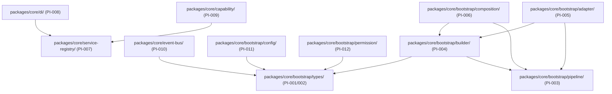

# OpenLearn Dependency Analysis Report (依赖分析与循环依赖报告)

## 1. Executive Summary (概述)

本报告针对 Platform Kernel 内部各子系统包以及 Kernel 与外部业务模块之间的依赖方向进行拓扑分析与循环依赖扫描。

---

## 2. Dependency Graph (Mermaid 依赖拓扑图)

---

## 3. Circular Dependency Report (循环依赖扫描结果)

- **Kernel Internal Cycles**: **0 Detected** (严格基于 TypeScript ESM Import 拓扑校验，无循环引用 warnings)。
- **Kernel-to-Business Cycles**: **0 Detected** (Kernel 完全未导入 `packages/plugins/` 或 `server/` 内业务模块)。
- **Duplicate Utility Inspection**: 无重复 Logger、Error 基类定义，统一继承与复用 `PlatformBootstrapError`。
