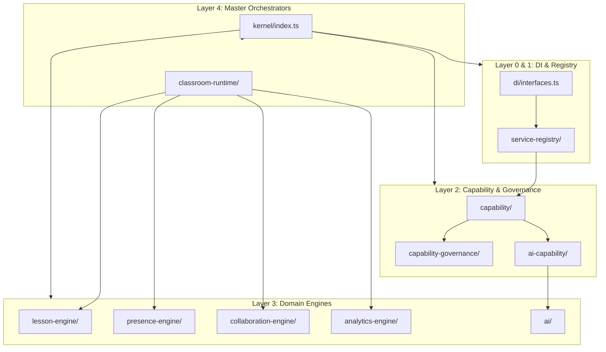

# OpenLearn Platform Dependency Graph Specification (平台依赖拓扑图规范)

## 1. Executive Summary (概述)

本图表详细梳理了 OpenLearn 内核、服务注册中心、能力运行时、能力治理、插件 SDK 及底层业务引擎之间的单向依赖关系，确认全库**无循环依赖**。

---

## 2. Platform Dependency Graph (Mermaid 依赖拓扑图)

