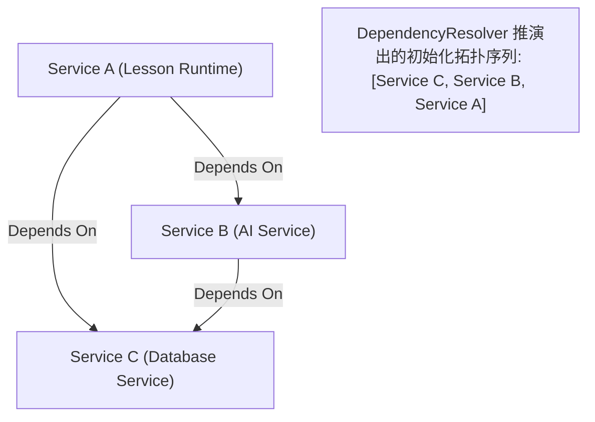

# OpenLearn Dependency Resolver Specification (依赖解析器规范)

## 1. Executive Summary (概述)

`DependencyResolver` 自动根据 `ServiceDescriptor.dependencies` 数组推演服务拓扑初始化顺序，并在启动期检测环状依赖。

---

## 2. Dependency Graph (Mermaid 依赖图拓扑解析)



---

## 3. Cycle Detection (循环依赖拦截)

若服务声明了 `A -> B -> A` 的依赖，`DependencyResolver.resolveOrder()` 将在启动初始化前抛出显式异常，阻止非法架构注入：

```typescript
// Error: Circular Service Dependency Detected: Dependency loop involving 'srv_a'
```
