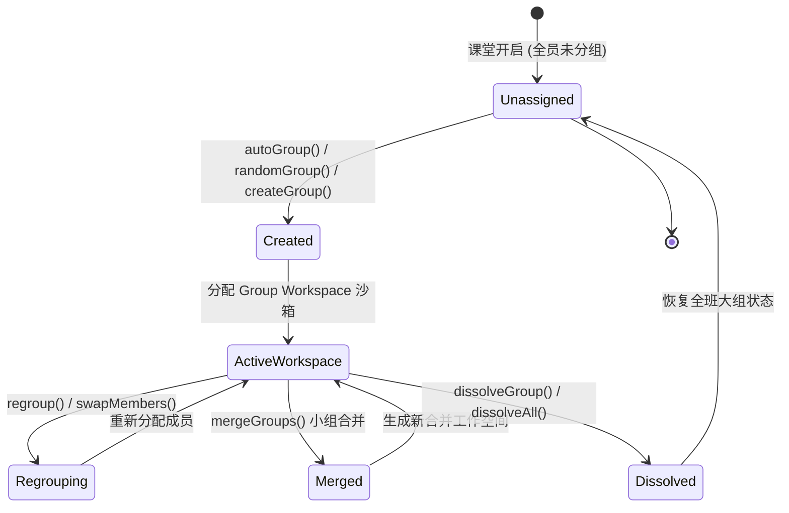

# OpenLearn Group Workspace & Lifecycle Specification (小组工作空间与生命周期)

## 1. Overview (概述)

`GroupManager` 与 `GroupWorkspaceStore` 负责管理课堂小组的生命周期以及每个小组独立的沙箱化工作空间 (Group Workspace)。

每个小组拥有完全隔离的 5 大工作要素：
1. **独立 Canvas (Independent Canvas)**
2. **独立 Teaching Objects (教学教具)**
3. **独立 Timeline (小组执行时间线)**
4. **独立 Plugin Runtime (插件运行沙箱)**
5. **独立 AI Context (小组 AI 辅导上下文)**

---

## 2. Group Lifecycle (Mermaid 小组生命周期图)

---

## 3. Group Management APIs (分组管理 API)

### `autoGroup(studentIds, groupSize)`
根据班级人数自动按指定容量（如每组 4 人）均匀分组。

### `randomGroup(studentIds, numberOfGroups)`
将学生随机洗牌打乱后划分为指定数量的小组。

### `swapMembers(groupId1, studentId1, groupId2, studentId2)`
在两个小组之间无缝对调成员，自动保持各自工作空间状态不变。

### `mergeGroups(groupId1, groupId2)`
合并两个小组及其工作空间内容，生成统一的合并工作空间。

### `dissolveGroup(groupId)` / `dissolveAll()`
解散小组并回收对应的 Group Workspace 沙箱资源。
