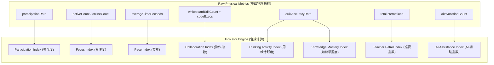

# OpenLearn High-Level Indicator Specification (高层概念指标规范)

## 1. Overview (概述)

`IndicatorEngine` 在物理指标（Raw Metrics）的基础之上，二次合成抽象的**高层概念指标 (High-Level Indicators)**，直接指导教学决策与 AI 建模。

---

## 2. Indicator Pipeline (Mermaid 指标合成流水线图)

---

## 3. High-Level Indicator Definitions (概念指标定义)

1. **`participationIndex` (课堂参与度: 0-100)**: 反映全班学生融入课堂互动的整体比例。
2. **`focusIndex` (课堂专注度: 0-100)**: 基于窗口焦点状态与实时行为活跃度合成。
3. **`paceIndex` (课堂节奏: 0-100)**: 评估当前教学推进速度与预设 Stage 时长的契合度。
4. **`collaborationIndex` (课堂协作指数: 0-100)**: 衡量小组与全班在白板、代码及讨论中的多点碰撞。
5. **`thinkingActivityIndex` (思维活跃度: 0-100)**: 融合答题准确性与代码调试频次的高阶思考推断。
6. **`knowledgeMasteryIndex` (知识掌握度: 0-100)**: 基于答题正确率与 Quiz 难度权重的掌握评估。
7. **`teacherPatrolIndex` (教师巡视指数: 0-100)**: 评估教师进入小组巡视及干预的覆盖度。
8. **`aiAssistanceIndex` (AI 辅助指数: 0-100)**: 测量 AI 助教在课堂讨论与疑难解答中的贡献权重。
