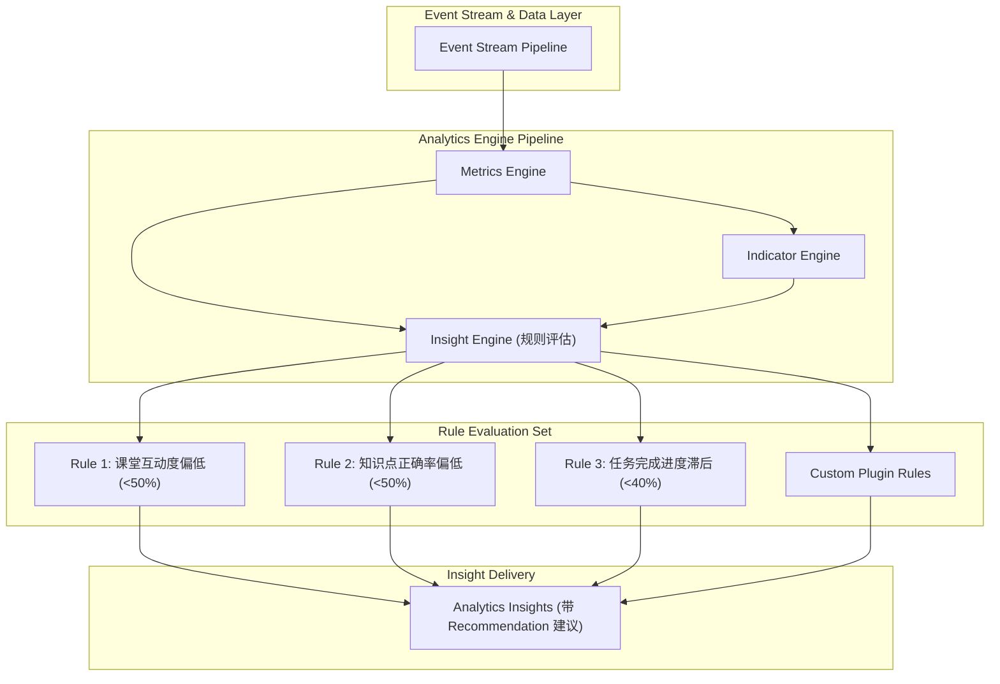

# OpenLearn Automated Insight Engine Specification (自动洞察引擎规范)

## 1. Overview (概述)

`InsightEngine` 采用**纯规则驱动引擎 (Rule-Based Engine)**，完全无需依赖外部 AI 模型。它实时评估物理指标与概念指标，自动识别课堂异常（如互动骤降、任务滞后、知识点困惑），并下发可执行的教学建议 (Recommendations)。

---

## 2. Metrics Pipeline (Mermaid 流水线图)

---

## 3. Automated Insight Rules (规则库说明)

| 规则名称 | 触发条件 | 警示级别 (Severity) | 洞察说明与建议 |
|---|---|---|---|
| **`Low Participation`** | `participationIndex < 50` | `warning` | **互动度偏低**：建议发起随堂提问或开启小组研讨 |
| **`Low Quiz Accuracy`** | `quizAccuracyRate < 50` | `critical` | **知识点困惑**：多数学生未掌握核心概念，建议暂停推新进行重点例题精讲 |
| **`Task Lagging`** | `completionRate < 40` | `warning` | **进度滞后**：任务完成率偏低，建议延长练习时长或下发提示 |
