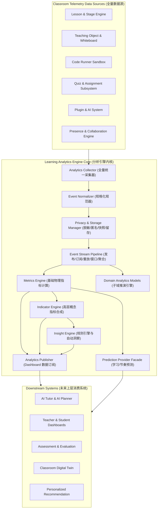
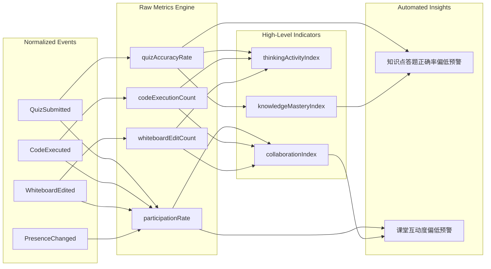

# OpenLearn Learning Analytics Engine Architecture & Design (学习分析引擎架构设计)

## 1. Overview (概述)

OpenLearn Learning Analytics Engine（学习分析引擎）是 OpenLearn 教学 OS 中统一的数据采集、规格归一化、事件流处理、指标推演与自动洞察中枢。

Analytics Engine 遵守**“只专注计算与推演，不涉及具体 UI 渲染”**的解耦原则。未来所有的上层展示与决策系统（**AI Agent**, **Teacher Dashboard**, **Student Dashboard**, **Assessment System**, **Recommendation**, **Digital Twin**）均建立在 Analytics Engine 吐出的计算模型之上。

---

## 2. Analytics Architecture (Mermaid 架构图)

---

## 3. Data Lineage (Mermaid 血缘关系图)

