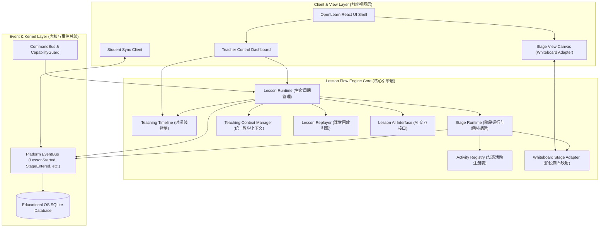

# OpenLearn Lesson Flow Engine Architecture & Design (课堂流程引擎架构设计)

## 1. Overview (概述)

OpenLearn Lesson Flow Engine（课堂流程引擎）是 OpenLearn 教学系统的核心运行骨干。本设计标志着系统从传统的“基于页面 (Page-based)”交互模式全量转型为“基于课堂流程 (Lesson Flow Engine)”的现代化教学运行架构。

在该架构下：
- **Page 仅为 View (视图渲染层)**。
- **真正运行与承载业务逻辑的是 Lesson 流程引擎**。
- 未来所有核心功能——**白板 (Whiteboard)**、**AI 智能助手 (AI Agent)**、**课堂互动 (Classroom Interaction)**、**插件系统 (Plugin SDK)** 以及 **课堂数据分析 (Analytics & Replay)**，均统一运行并联动于 Lesson Flow 上。

---

## 2. Core Domain Hierarchy (核心领域模型层级)

系统遵循统一的七层模型结构：

```
Lesson (课堂)
  │
  ├── Flow (教学流程)
  │     │
  │     ├── Stage (教学阶段/环节)
  │     │     │
  │     │     ├── Activity (教学活动)
  │     │     │     │
  │     │     │     ├── Teaching Object (教学教具与对象)
  │     │     │     │     │
  │     │     │     │     └── Student Action (学生互动行为)
  │     │     │     │           │
  │     │     │     │           └── Analytics (课堂评估与数据分析)
```

### 2.1 Lesson 模型
代表一门完整的课堂模式实体。
- **属性**: `id`, `title`, `subject`, `grade`, `teacher`, `durationMinutes`, `status`, `flows`, `createdAt`, `updatedAt`, `metadata`
- **生命周期状态**: `draft` -> `ready` -> `active` <-> `paused` -> `completed`

### 2.2 Flow 模型
代表一节课的具体教学工作流（例如导入、新知学习、课堂演示、小组讨论、课堂练习、课堂总结、作业布置）。
- **能力**: 新增、删除、复制、拖拽排序、版本管理与回滚。

### 2.3 Stage 模型
Flow 内部划分为多个 Stage（例如“课堂练习”Flow 包含“练习一”、“练习二”、“练习三”）。
- **属性**: `title`, `estimatedDurationSeconds`, `teachingGoals`, `knowledgePoints`, `completionStatus`, `assignee`, `activities`, `locked`, `analytics`

### 2.4 Activity 模型
Stage 内部的基本执行单元，例如播放视频、展示图片、运行 Python、开始 Quiz、开始讨论、AI 生成问题、网页浏览、GeoGebra 演示等。
- **操作接口**: `start()`, `pause()`, `end()`, `skip()`, `resume()`

### 2.5 Activity Registry
提供解耦的插件化注册接口 `registerActivity()`。第三肢插件（如 Coding Activity, Simulation Activity, VR Activity, MindMap Activity）可无缝扩展活动类型，无需修改 Lesson Engine 核心。

---

## 3. Lesson Architecture (Mermaid 架构图)



---

## 4. Subsystem Responsibilities (子系统职责)

1. **Teaching Timeline (教学时间线)**: 控制 Next, Previous, Jump, Restart, Preview，并提供毫秒级全员实时同步能力。
2. **Stage Runtime (阶段运行层)**: 管理 Stage 进入、退出、暂停、恢复、自动结束、超时提醒以及自动完成度/热度数据收集。
3. **Teaching Context (统一教学上下文)**: 暴露统一的标准访问接口，全系统任何 Object/插件均可无感获取 `Current Lesson`, `Current Flow`, `Current Stage`, `Current Activity`, `Teacher`, `Student`, `Role`。
4. **Whiteboard Integration (白板阶段化绑定)**: 白板摆脱旧有 Page 绑定，转向 Stage View 管理。每个 Stage 对应独立的 Canvas，并支持 Cross-Stage Object 跨阶段共享。
5. **AI & Replay Foundation**: 提供标准 API 供 AI 机器人提取上下文并生成测验、总结或教案；同时记录全量时间线事件以支持课后完整 Replay。
