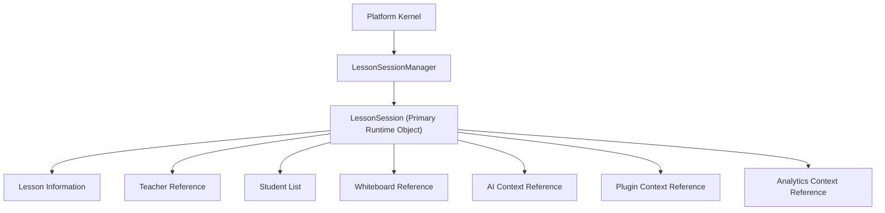

# OpenLearn Lesson Session Runtime Specification (课程会话运行时规范)

## 1. Executive Summary (概述)

在 Sprint A2 (Lesson Session Runtime) 中，实现了 `LessonSession` 与 `LessonSessionManager` (`packages/core/bootstrap/lesson-session/`)。`LessonSession` 成为 Platform Kernel 托管的核心运行时对象，包装了现有的 Lesson 业务逻辑，建立了可容纳 AI、Whiteboard、Plugin 及 Analytics 上下文引用的会话空间。

---

## 2. Lesson Session Architecture (Mermaid 架构图)

---

## 3. Lesson Session State Machine (生命周期状态机)

`LessonSession` 的完整状态流转图如下：

`Created` → `Preparing` → `Running` ⇄ `Paused` → `Completed` → `Archived` → `Disposed`

非法状态跳转断言将被严格抛出断言拦截。
