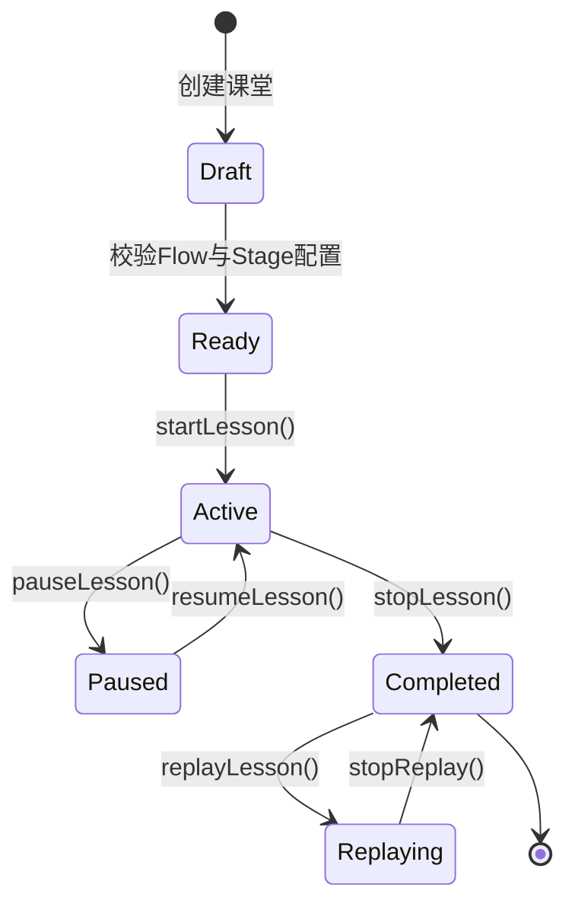
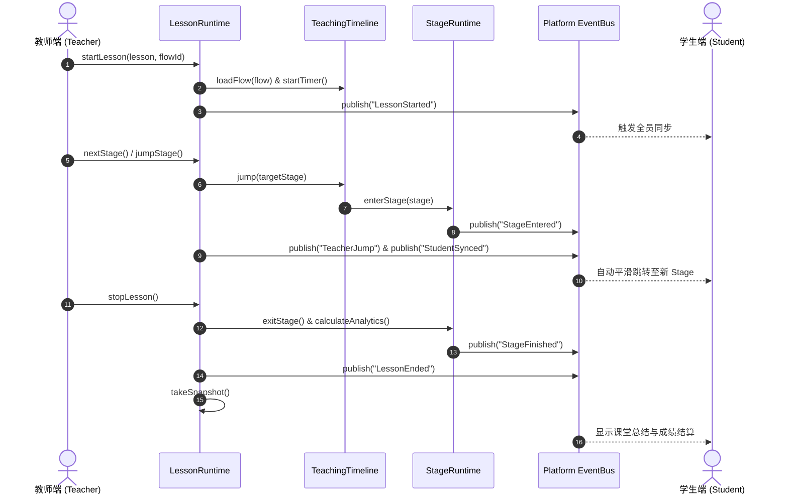

# OpenLearn Lesson Runtime Specification (课堂运行时规范)

## 1. Overview (概述)

`LessonRuntime` 是 OpenLearn Lesson Flow Engine 的最高指挥官与全局编排器。它负责管控整节课的生命周期转换、快照拍摄 (Snapshot)、回放 (Replay)、教师主控指令 (Teacher Control) 以及学生端实时同步 (Student Synchronization)。

---

## 2. Lesson Lifecycle States & Transitions (生命周期转换)

### 2.1 核心生命周期 API
- **`startLesson(lesson, flowId?)`**: 启动课堂，激活指定 Flow，启动总计时器并发布 `LessonStarted` 事件。
- **`pauseLesson()`**: 暂停当前课堂及活跃 Stage 计时器，发布 `LessonPaused` 事件。
- **`resumeLesson()`**: 恢复当前课堂及活跃 Stage，发布 `LessonStarted` 事件。
- **`stopLesson()`**: 结束课堂，计算整堂课与各 Stage 汇总分析报告，发布 `LessonEnded` 事件，自动生成最终 Snapshot。
- **`takeSnapshot()`**: 捕捉当前 Lesson、Flow、Stage、Activity、计时器及 Whiteboard Canvas View 状态并持久化。
- **`replayLesson(snapshotId?)`**: 基于时间线事件流与 Snapshot 快照全仿真重放课堂过程。

---

## 3. Teacher Control (教师操控能力)

教师在教学过程中拥有绝对的流程控制权限：

| 操控指令 | 对应方法 | 描述与行为 |
|---|---|---|
| **Next Stage** | `nextStage()` | 推进至下一个 Activity 或 Stage |
| **Back Stage** | `backStage()` | 回退至上一个 Activity 或 Stage |
| **Lock Stage** | `lockStage(stageId, locked)` | 锁定当前 Stage，禁止学生侧交互提交 |
| **Skip Stage** | `skipStage(stageId)` | 跳过指定 Stage 并标记为 `skipped` |
| **Jump Stage** | `jumpStage(targetStageId)` | 无缝跳转至任意 Stage 或 Activity |
| **Repeat Stage** | `repeatStage(stageId)` | 重新开始指定 Stage 的教学 |
| **Presentation Mode** | `setPresentationMode(enabled)`| 开启/关闭全屏沉浸式演示模式 |

---

## 4. Lesson Runtime Sequence (Mermaid 序列表)

---

## 5. Student Synchronization (学生无感同步)

学生端通过 `StudentSyncService` 实时订阅 `StudentSynced` 与 `TeacherJump` 事件。
- 当教师推进 Timeline 或跳转 Stage 时，学生端接收事件并自动切换对应 Stage View、Activity 及 Teaching Object。
- **无需刷新页面 (Zero Refresh)**，确保教学连续性与零干扰体验。
