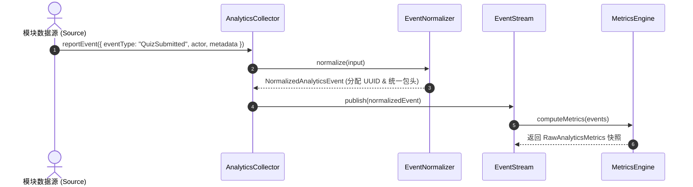

# OpenLearn Raw Metrics Specification (基础物理指标规范)

## 1. Overview (概述)

`MetricsEngine` 从 `EventStream` 接收归一化的 `NormalizedAnalyticsEvent` 事件流，以异步批处理或增量方式实时推导基础物理指标（Raw Metrics）。

---

## 2. Event Flow (Mermaid 事件流推导图)

---

## 3. Metrics Catalogue (物理指标清单)

| 指标字段 | 说明 | 计算公式 / 来源 |
|---|---|---|
| **`onlineCount`** | 课堂实时在线学生人数 | `Presence` 握手与连接集合求和 |
| **`activeCount`** | 触发有效交互行为的活跃学生数 | 触发 Quiz/Code/Whiteboard/Chat 的去重学生数 |
| **`participationRate`** | 课堂参与率 (0-100%) | `(activeCount / totalStudents) * 100%` |
| **`totalInteractions`** | 课堂产生的总交互事件数 | `EventStream` 全量事件数 |
| **`quizAnswerRate`** | 测验作答率 (0-100%) | `(quizSubmits / totalStudents) * 100%` |
| **`quizAccuracyRate`** | 测验答题正确率 (0-100%) | `(quizCorrect / quizSubmits) * 100%` |
| **`averageTimeSeconds`** | 学生互动平均耗时 | 交互事件流持续时间累计与均化 |
| **`completionRate`** | 任务阶段整体完成率 (0-100%) | 已提交 Quiz/任务的学生占比 |
| **`codeExecutionCount`** | 代码编译与运行总次数 | `CodeExecuted` 事件计数 |
| **`whiteboardEditCount`** | 白板编辑与图画绘制总次数 | `WhiteboardEdited` 事件计数 |
| **`aiInvocationCount`** | AI 交互与生成总次数 | `AIInvoked` / `AIResponse` 事件计数 |
