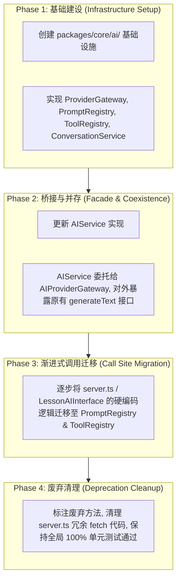

# OpenLearn AI Infrastructure Migration Guide (AI 基础设施迁移指南)

## 1. Overview (概述)

为了防止打破已有的 AI 功能和第三方插件兼容性，AI 基础设施迁移遵循严格的**4 阶段平滑迁移路线图 (Phase-based Migration Roadmap)**。

---

## 2. Migration Flow (Mermaid 迁移流程图)



---

## 3. Detailed Step-by-Step Instructions (逐步操作指引)

### 3.1 步骤 1：全量使用 `packages/core/ai/` 入口
旧的 AI 插件或核心模块可通过 `@openlearn/plugin-sdk` 导出注入：

```typescript
import { IPresenceEngineServiceToken, ILearningAnalyticsServiceToken, IAIServiceToken } from '@openlearn/plugin-sdk';

// 原有 generateText 保持 100% 兼容
const aiService = await ctx.resolve(IAIServiceToken);
const text = await aiService.generateText('hello');
```

### 3.2 步骤 2：注册自定义 Tool 或 Prompt
对于需要扩展工具的插件：

```typescript
import { AIRuntimeKernel } from '@openlearn/core';

// 注册插件专属 Prompt 模板
aiRuntimeKernel.promptRegistry.registerPrompt({
  id: 'ext_custom_prompt',
  name: '插件专属提示词',
  category: 'general',
  version: 1,
  template: '请根据 {{context}} 给出分析',
  tags: ['plugin'],
});
```

---

## 4. Rollback Plan (回滚方案)

如果在迁移过程中发现任何未预期的 AI 响应异常：
1. `AIService` 内部保留了直接请求 `ai_providers` 数据库的原生 fallback 逻辑，可通过配置开关瞬间切回。
2. 现有的单元测试套件 (`packages/core/__tests__/ai-runtime.test.ts`) 提供了 100% 的单元隔离断言，确保改动安全可控。
