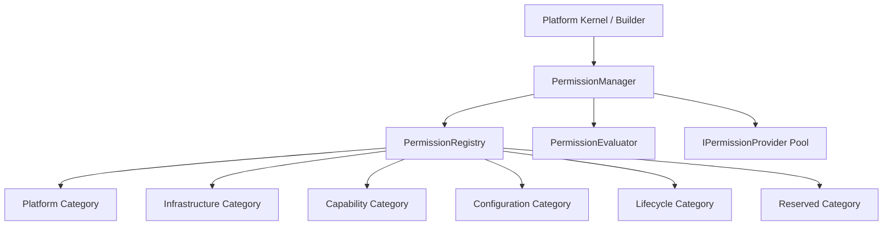

# OpenLearn Platform Permission Framework Specification (平台权限框架规范)

## 1. Executive Summary (概述)

在 Platform Kernel Increment PI-012 中，实现了 **Platform Permission Framework** 平台权限框架（位于 `packages/core/bootstrap/permission/`）。

**核心规约：Platform Permission Framework 专注于平台内核与基础设施级别的鉴权与访问控制（如 Capability 执行、配置写入、服务接入、生命周期控制），绝对不是用户 RBAC 角色系统，绝对不处理教师/学生/班级/课堂业务权限**。

---

## 2. Permission Architecture & Categories (Mermaid 架构与分类图)

---

## 3. Permission Policies (策略类型)

- **`Allow`**: 明确允许调用或访问。
- **`Deny`**: 明确拒绝调用或访问。
- **`Default`**: 缺省策略（无显式允许则默认拒绝）。
- **`Inherited`**: 继承上层作用域策略。
- **`Reserved`**: 预留策略。

---

## 4. Evaluation Sequence (鉴权求值顺序)

1. **Explicit Subject Grants / Revokes**: 显式对 Subject 的 `grant()` / `revoke()` 赋权比对。
2. **Permission Providers**: 循环绑定的 `IPermissionProvider` 求值。
3. **Descriptor Default Policy**: 匹配 `PermissionDescriptor.defaultPolicy`。
4. **Fallback Default Deny**: 默认拒绝。
