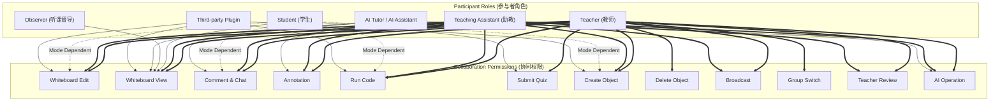

# OpenLearn Dynamic Permission Matrix (协同权限矩阵规范)

## 1. Overview (概述)

`PermissionMatrixManager` 维护全套解耦且支持运行时动态切换的权限矩阵。角色的权限配置并非静态不变，而是随当前激活的 `CollaborationMode` 动态推演与无感调整。

---

## 2. Permission Graph (Mermaid 权限控制图)

---

## 3. Dynamic Mode Adaptation (动态模式权限适配)

当教师切换课堂协同模式时，权限矩阵自动执行动态更新：

- **切换至 `Teacher Presentation`**:
  - 学生 `Student` 自动剥夺 `Whiteboard Edit` 与 `Create Object` 权限。
  - 保留 `Whiteboard View` 与 `Submit Quiz`。
- **切换至 `Small Group` / `Teacher + Student`**:
  - 学生 `Student` 自动赋予 `Whiteboard Edit`、`Create Object` 与 `Run Code` 权限。
- **切换至 `Teacher Review`**:
  - 全员学生自动切换为 `ReadOnly` 视图，白板面板冻结，保障教师集中展示与点评。
