# OpenLearn Platform Architecture Audit (平台架构深度审计)

## 1. Executive Summary (概述)

本架构审计报告严格基于 OpenLearn v2 代码库实证扫描，评估系统对目标 **Platform Kernel Architecture**（`Platform Kernel` → `Service Registry` → `Capability Runtime` → `Extension Framework` → `Business Modules` → `AI Layer`）的符合度与合规状态。

在本次审计中，**未修改、新增或删除任何源代码**。所有数据与图表均来自于对 `packages/core/`、`packages/plugins/`、`server.ts` 及 `src/` 的静态与依赖特征分析。

---

## 2. Target Layer Architecture (Mermaid 平台层级架构图)

```mermaid
graph TD
    subgraph Layer0 ["Platform Kernel Layer (核心层)"]
        Kernel["Kernel (packages/core/kernel/)"]
        DB["SQLite Database (packages/core/db/)"]
        EventBus["EventBus (packages/core/event-bus/)"]
    end

    subgraph Layer1 ["Platform Service Registry Layer (服务注册中心层)"]
        ServiceRegistry["ServiceRegistryKernel (packages/core/service-registry/)"]
        DIContracts["DI Contracts & Tokens (packages/core/di/interfaces.ts)"]
    end

    subgraph Layer2 ["Capability Runtime & Governance Layer (能力运行时与治理层)"]
        CapRuntime["CapabilityRuntimeKernel (packages/core/capability/)"]
        CapGovernance["CapabilityGovernanceKernel (packages/core/capability-governance/)"]
        AICapability["AICapabilityKernel (packages/core/ai-capability/)"]
    end

    subgraph Layer3 ["Extension Framework & Sandbox Layer (插件扩展层)"]
        PluginHost["PluginHost & WorkerManager (packages/core/plugin-host/)"]
        SDK["Plugin SDK (@openlearn/plugin-sdk)"]
    end

    subgraph Layer4 ["Business Engine Modules Layer (业务引擎层)"]
        ClassroomRuntime["ClassroomRuntimeKernel (packages/core/classroom-runtime/)"]
        LessonEngine["LessonRuntime (packages/core/lesson-engine/)"]
        PresenceEngine["PresenceEngineKernel (packages/core/presence-engine/)"]
        CollaborationEngine["CollaborationEngineKernel (packages/core/collaboration-engine/)"]
        AnalyticsEngine["AnalyticsEngineKernel (packages/core/analytics-engine/)"]
    end

    subgraph Layer5 ["AI Infrastructure Layer (AI 基础设施层)"]
        AIRuntime["AIRuntimeKernel (packages/core/ai/)"]
        Gateway["AIProviderGateway (OpenAI / Gemini)"]
    end

    Layer0 --> Layer1
    Layer1 --> Layer2
    Layer2 --> Layer3
    Layer3 --> Layer4
    Layer4 --> Layer5
```

---

## 3. Platform Service Graph (Mermaid 服务依赖关系拓扑图)

```mermaid
graph TD
    KernelServices["Kernel ServiceRegistry"]
    AIService["AIServiceContract (@openlearn/core:IAIService)"]
    LessonService["LessonServiceContract (@openlearn/core:ILessonEngineService)"]
    ClassroomService["ClassroomRuntimeContract (@openlearn/core:IClassroomRuntimeService)"]
    PresenceService["PresenceEngineContract (@openlearn/core:IPresenceEngineService)"]
    CollaborationService["CollaborationServiceContract (@openlearn/core:ITeachingCollaborationService)"]
    AnalyticsService["AnalyticsServiceContract (@openlearn/core:ILearningAnalyticsService)"]
    AICapService["AICapabilityServiceContract (@openlearn/core:IAICapabilityService)"]
    CapRuntimeService["CapabilityRuntimeServiceContract (@openlearn/core:ICapabilityRuntimeService)"]
    CapGovService["CapabilityGovernanceServiceContract (@openlearn/core:ICapabilityGovernanceService)"]
    RegistryService["PlatformServiceRegistryContract (@openlearn/core:IPlatformServiceRegistryService)"]

    KernelServices --> AIService & LessonService & ClassroomService & PresenceService & CollaborationService & AnalyticsService & AICapService & CapRuntimeService & CapGovService & RegistryService
```

---

## 4. Subsystem Coupling Audit (解耦情况分析)

1. **Lesson ↔ Whiteboard**: 采用 `WhiteboardAdapter` 进行数据格式解耦，无需直接加载白板渲染组件。
2. **Plugin ↔ AIService**: 插件通过 `PluginContext.services` 统一解析 `IAIServiceToken` 或 `IAICapabilityServiceToken`，禁止插件使用绝对路径 `import` 核心模块。
3. **Analytics ↔ Core Engines**: `AnalyticsEngine` 纯通过监听 `EventBus` 中的标准解耦事件进行学情捕获。
