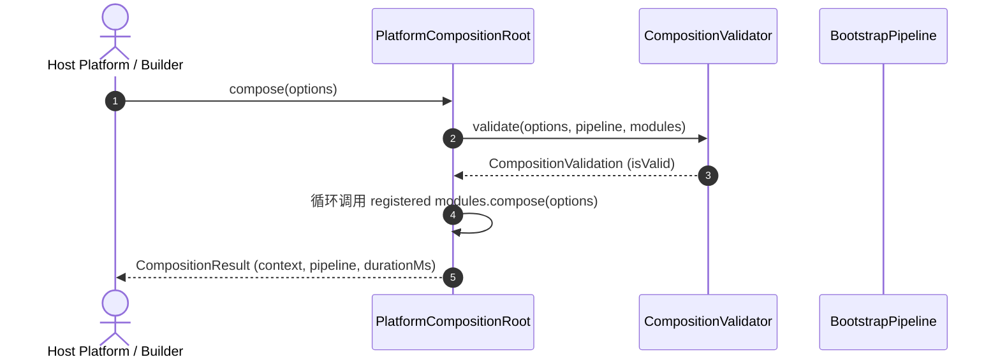

# OpenLearn Platform Assembly Specification (平台组装规范)

## 1. Executive Summary (概述)

本文档规范了平台基础设施组装的唯一入口与规则，确保没有任何业务模块或外部插件能直接绕过 Composition Root 创建强硬依赖。

---

## 2. Infrastructure Assembly Flow (Mermaid 组装流程图)

