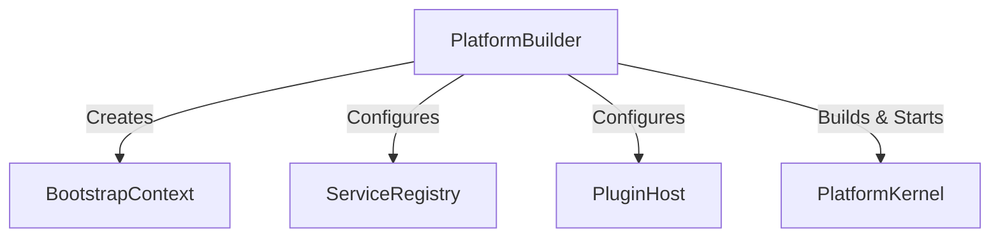

# OpenLearn Platform Builder Specification (平台构建器规范)

## 1. Executive Summary (概述)

`PlatformBuilder` 为平台组装与启动提供流式链式调用 API（Fluent API），屏蔽底层复杂的对象图构建逻辑。

---

## 2. Dependency Graph (Mermaid 构建器依赖拓扑图)



---

## 3. PlatformBuilder API Specification (接口规范)

```typescript
export interface IPlatformBuilder {
  withConfig(config: Record<string, unknown>): IPlatformBuilder;
  addService<T>(token: Token<T>, instance: T): IPlatformBuilder;
  addPluginPath(pluginDir: string): IPlatformBuilder;
  enableDebugLogs(enabled: boolean): IPlatformBuilder;
  build(): Promise<PlatformKernel>;
  buildAndStart(): Promise<PlatformKernel>;
}
```
