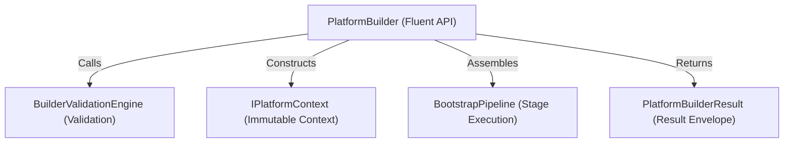

# OpenLearn Platform Builder Specification (平台构建器规范)

## 1. Executive Summary (概述)

`PlatformBuilder` (`packages/core/bootstrap/builder/`) 为平台组装提供公开唯一入口与流式链式调用 API (Fluent API)。

在 PI-004 中，`PlatformBuilder` **仅负责组装构建 PlatformKernel 及其依赖组件，绝对不自动启动平台，绝对不执行任何业务逻辑**。

---

## 2. PlatformBuilder Architecture (Mermaid 依赖拓扑图)



---

## 3. Builder State Machine (状态机状态流转)

`PlatformBuilder` 内部严格管理以下 6 种状态：
`Created` → `Configuring` → `Validating` → `Building` → `Built` → `Disposed`

针对已处置 (`Disposed`) 或已构建 (`Built`) 的 Builder 实例触发非法调用时，自动抛出异常断言保护。

---

## 4. PlatformBuilder API Specification (API 接口规范)

```typescript
export interface IPlatformBuilder {
  withConfiguration(config: Partial<PlatformBootstrapConfig>): IPlatformBuilder;
  withLogger(logger: IPlatformLogger): IPlatformBuilder;
  withEnvironment(env: EnvironmentType): IPlatformBuilder;
  addService<T>(serviceId: ServiceId, instance: T): IPlatformBuilder;
  addCapability(capabilityId: CapabilityId, descriptor: unknown): IPlatformBuilder;
  addExtension(extensionId: ExtensionId, extensionSpec: unknown): IPlatformBuilder;
  build(): Promise<IPlatformLifecycle>;
  start(): Promise<IPlatformLifecycle>;
  shutdown(): Promise<void>;
}
```

### 4.1 Structured Logging (结构化调试日志)
构建过程自动记录标准前缀日志：
- `[PlatformBuilder:INFO] Builder Started`
- `[PlatformBuilder:INFO] Configuration Loaded`
- `[PlatformBuilder:INFO] Validation Started`
- `[PlatformBuilder:INFO] Validation Completed`
- `[PlatformBuilder:INFO] Build Started`
- `[PlatformBuilder:INFO] Build Completed in X ms`
