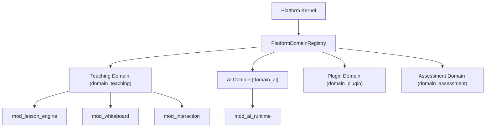

# OpenLearn Platform Domain Specification (平台业务域管理与注册规范)

## 1. Executive Summary (概述)

在 Sprint A2 (Platform Domain Registry) 中，实现了 `PlatformDomainRegistry` (`packages/core/bootstrap/domain-registry/`)。该注册表使 Platform Kernel 从原本孤立管理散乱模块提升至以**限界上下文业务域 (Bounded Business Domains)** 视角组织平台能力。

业务域（如 `Teaching`, `AI`, `Plugin`, `User`, `Course`, `Assessment`, `Analytics`, `Storage`, `Notification`, `Collaboration`, `Search`, `Security`）收纳归属其下的子模块列表，**只进行显式元数据定义与分域归集，绝对不移动代码，绝对不干预运行期控制**。

---

## 2. Platform Domain Hierarchy (Mermaid 领域层级关系图)

---

## 3. PlatformDomainDescriptor Data Contract (业务域元数据契约)

每个注册业务域包含以下字段：
- `id`: 业务域唯一标识符（如 `domain_teaching`）
- `name`: 业务域英文 Key
- `displayName`: 可读显示名
- `description`: 限界上下文边界说明
- `version`: SemVer 版本号
- `category`: 领域分类 (`Core` | `Business` | `Infrastructure` | `AI` | `Extension`)
- `owner`: 负责团队或 Maintainer（可选）
- `dependencies`: 依赖的其他业务域 ID 列表
- `modules`: 归属于该业务域的模块 ID 列表 (`ReadonlyArray<string>`)
- `status`: 运行状态 (`Unknown` | `Registered` | `Active` | `Inactive` | `Error`)
- `health`: 领域健康度描述
- `capabilities`: 领域向外暴露的能力清单
