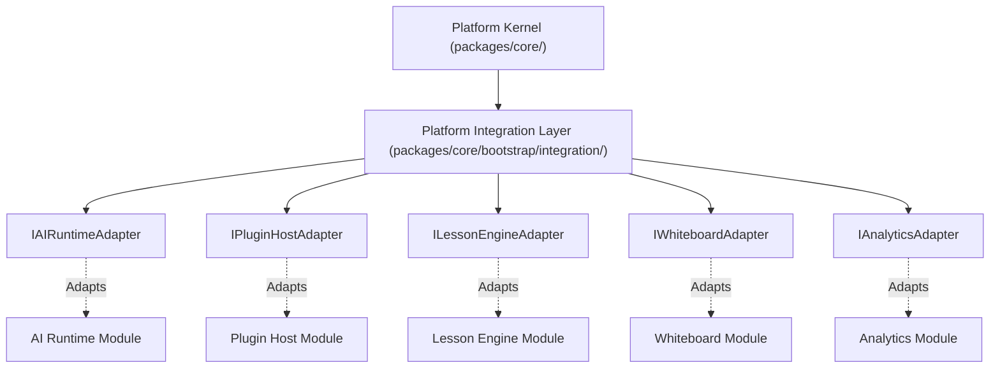

# OpenLearn Platform Integration Layer Specification (平台集成层规范)

## 1. Executive Summary (概述)

`Platform Integration Layer` (`packages/core/bootstrap/integration/`) 为 Platform Kernel 提供了与业务模块（AI Runtime, Plugin Host, Lesson Engine, Whiteboard, Analytics）解耦的集成适配层。

**核心架构规约：Platform Kernel 绝对禁止直接依赖或操作业务引擎，所有业务域操作必须经由统一的 `IntegrationAdapter` 接口协议通信**。

---

## 2. Integration Hierarchy (Mermaid 依赖层级图)

---

## 3. Standard Integration Lifecycle Contract (适配器生命周期契约)

每个业务域适配器都必须实现统一的生命周期契约：
- `initialize(context: IntegrationContext)`: 初始化适配器上下文
- `activate()`: 激活适配器
- `deactivate()`: 停用适配器
- `dispose()`: 释放资源
- `health()`: 检查健康状态并返回 `IntegrationHealthStatus`
- `metadata()`: 返回适配器描述信息 `IntegrationDescriptor`
