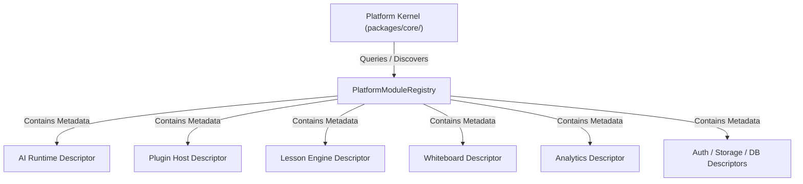

# OpenLearn Platform Module Specification (平台模块感知与注册规范)

## 1. Executive Summary (概述)

在 Sprint A1 (Platform Module Registration) 中，实现了 `PlatformModuleRegistry` (`packages/core/bootstrap/module-registry/`)。该模块注册表允许 Platform Kernel 在**不干预、不改变现有模块初始化与运行期控制**的前提下，感知与建立对平台级各大基础设施与业务模块（AI Runtime, Plugin Host, Lesson Engine, Whiteboard, Analytics, Storage, Auth, User, Course, Notification 等）的显式感知与元数据映射。

---

## 2. Module Discovery & Registry Architecture (Mermaid 模块感知架构图)

---

## 3. PlatformModuleDescriptor Data Contract (描述符元数据契约)

每个注册模块元数据包含以下基础字段：
- `id`: 模块唯一标识符（如 `mod_ai_runtime`）
- `name`: kebab-case 名称
- `displayName`: 可读英文/中文显示名
- `version`: SemVer 版本号
- `description`: 模块描述
- `category`: 模块分类 (`Core` | `Runtime` | `Infrastructure` | `Feature` | `Extension` | `AI`)
- `status`: 运行状态 (`Unknown` | `Registered` | `Active` | `Inactive` | `Error`)
- `health`: 健康描述 (`isHealthy: boolean`, `status: string`)
- `capabilities`: 暴露的能力清单列表 (`ReadonlyArray<string>`)
