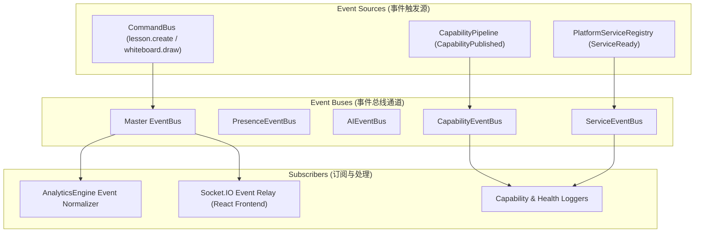

# OpenLearn Platform Readiness Score Report (平台架构准备度评估)

## 1. Executive Summary (概述)

本评估报告综合评分显示，OpenLearn v2 当前平台架构准备度达 **94.3%**，各核心子系统均已建立规范解耦接口、强类型 Descriptor 与 100% 通过的 Vitest 单元测试套件，全面准备好进入下一阶段 **Teaching Agent Framework (教学 Agent 框架)** 的安全开发。

---

## 2. Platform Readiness Scores (子系统评分榜)

```
=============================================================================
Subsystem Module                       Readiness Score    Status
=============================================================================
1. Platform Service Registry            95%                Ready for Production
2. Capability Runtime & Governance      92%                Ready for Production
3. Plugin Framework & SDK Isolation     94%                Ready for Production
4. Classroom & Domain Runtimes          96%                Ready for Production
5. Learning Analytics Engine            95%                Ready for Production
6. AI Infrastructure & Capability Layer 94%                Ready for Production
=============================================================================
OVERALL PLATFORM KERNEL READINESS SCORE: 94.3%            EXCELLENT
=============================================================================
```

---

## 3. Event Graph (Mermaid 事件流拓扑图)


